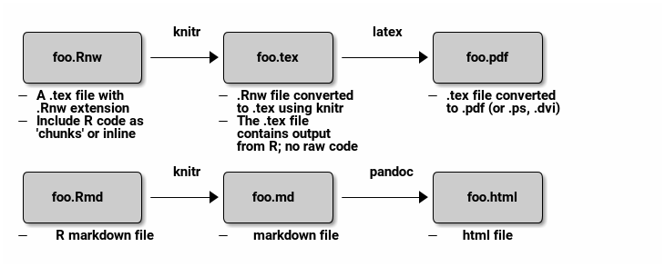
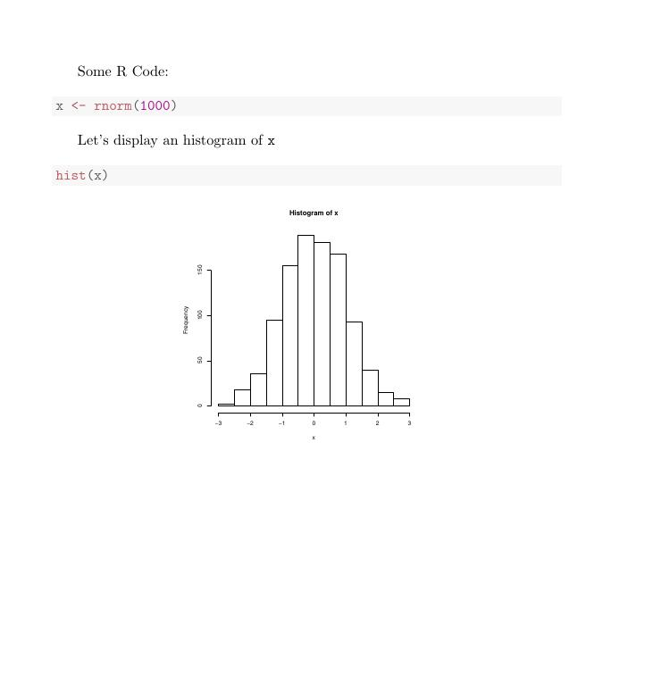
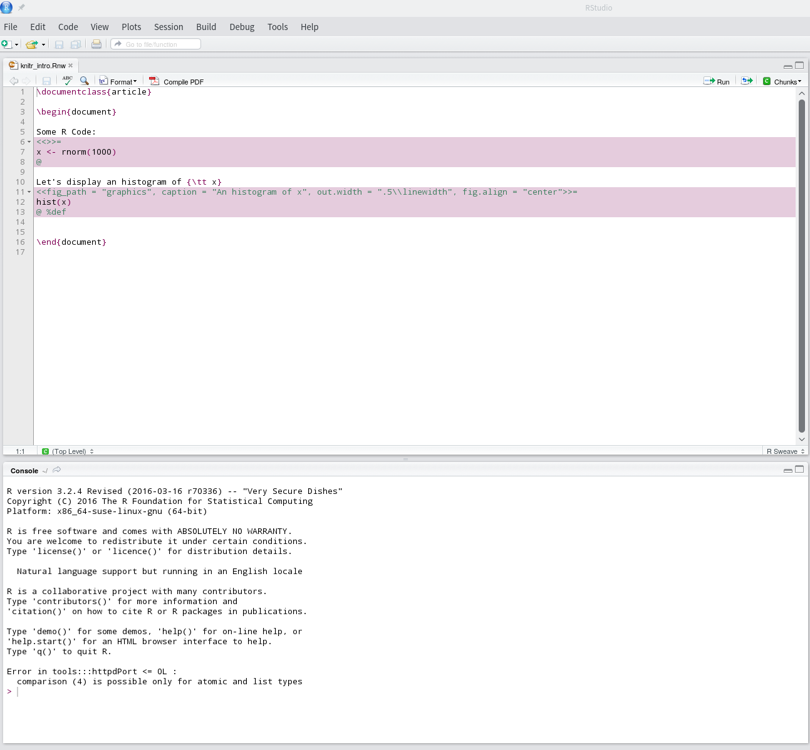

# Introduction

## What is R?

- R is *an environment for statistical computing and graphics*
	- free software (GPL license)
	- Available for Linux, Solaris, Windows, Mac OSX

- Derived from the S language
  
- http://www.r-project.org/

- The strength of R is its community
	- &ge; 6000 packages additional packages implementating the latest
      statistical techniques
	- http://cran.r-project.org/

## What is R?

- R is an interactive language
	- Statements converted to machine instructions as they are
      encountered
	- Flexible but slower than compiled code
- Object oriented (kinda)
- R provides excellent graphics functionality (base graphics and
  additional packages)

- Can be used both as a glorified calculator or as a "real"
  programming language

# Basics

## R as a calculator


```r
1 + 1
```

```
[1] 2
```

```r
2 + 3 * 4
```

```
[1] 14
```

```r
sqrt(9)
```

```
[1] 3
```

```r
pi
```

```
[1] 3.141593
```


## R as a smart calculator


```r
x <- 5            #allocate value to an object
x = 5             #as above
print(x)          # objects in console
```

```
[1] 5
```

```r
x                 #same
```

```
[1] 5
```

```r
a <- sqrt(81)     #square root
b <- exp(2)       #exponential function
c <- log(50)      #logarithm
a * b + c         #basic operations
```

```
[1] 70.41353
```


## Getting help
	
- At the R prompt

```r
help("fun")
?fun
```

- The **sos** package (see next slide for installing packages) and the `findfn` function

- On the internet
	- [R mailing list](https://stat.ethz.ch/mailman/listinfo/r-help)
	- [stackoverflow](http://stackoverflow.com/)
	- [Cross Validated](http://stats.stackexchange.com/)

## Packages

- Install package

```r
install.packages("new_package")
install.packages(c("new_package1", "new_package2"))
```

- Update packages

```r
update.packages()
```

- Packages available from, e.g., [CRAN](http://cran.r-project.org/)
- CRAN [task views](http://cran.r-project.org/web/views/) provide list of
  packages grouped by theme

# Operations

## Vector operations


```r
# define vector by means of the
# specification of its single elements
W <- c(1,2,3,5,9,7)  
W
```

```
[1] 1 2 3 5 9 7
```

```r
# vector with a 3 (repeated 5 times)
X <- rep(3,5)        
X
```

```
[1] 3 3 3 3 3
```

```r
# combine vectors 
A <- c(W,X)
A
```

```
 [1] 1 2 3 5 9 7 3 3 3 3 3
```

## Vector operations


```r
# vector with values from 1 to 10 with stepsize 2
Y <- seq(0,10,2)     
Y
```

```
[1]  0  2  4  6  8 10
```

```r
#equals seq(0,10,1)
Z <- 0:10            
Z
```

```
 [1]  0  1  2  3  4  5  6  7  8  9 10
```

```r
# element-wise addition
W+Y
```

```
[1]  1  4  7 11 17 17
```

```r
# element-wise multiplication
W*Y
```

```
[1]  0  4 12 30 72 70
```

```r
# element-wise multiplication with a scalar
5*W               
```

```
[1]  5 10 15 25 45 35
```

## Vector operations


```r
length(W)         #determine length of vector
```

```
[1] 6
```

```r
t(W)%*%Y          #transposition and vector multiplication
```

```
     [,1]
[1,]  188
```

```r
W[4]              #select specific element
```

```
[1] 5
```

## Vector operations

```r
W[W>2]
```

```
[1] 3 5 9 7
```

```r
W[W>2 & W<7]
```

```
[1] 3 5
```

```r
which(W>2)        #determine indices where a condition holds
```

```
[1] 3 4 5 6
```

## Matrix operations


```r
A=matrix(0,nrow=2,ncol=3)   #Initialize 2x3 matrix including 0
A
```

```
     [,1] [,2] [,3]
[1,]    0    0    0
[2,]    0    0    0
```

```r
A[1,3]=5          #allocate single value at position (1,3)
A
```

```
     [,1] [,2] [,3]
[1,]    0    0    5
[2,]    0    0    0
```

```r
A[,2]=c(1,2)      #allocate values to a whole column (analogously with rows)
A
```

```
     [,1] [,2] [,3]
[1,]    0    1    5
[2,]    0    2    0
```

## Matrix operations

```r
A[-3]             # A without the third element
```

```
[1] 0 0 2 5 0
```

```r
B=matrix(c(1,1,1,2,2,2,3,3,3),3,3) #Initialize matrix with single values
B
```

```
     [,1] [,2] [,3]
[1,]    1    2    3
[2,]    1    2    3
[3,]    1    2    3
```

```r
C=diag(c(1,2,3))  #diagonal matrix
C         
```

```
     [,1] [,2] [,3]
[1,]    1    0    0
[2,]    0    2    0
[3,]    0    0    3
```

## Matrix operations

```r
B * C               #element-wise operations
```

```
     [,1] [,2] [,3]
[1,]    1    0    0
[2,]    0    4    0
[3,]    0    0    9
```

```r
B + C
```

```
     [,1] [,2] [,3]
[1,]    2    2    3
[2,]    1    4    3
[3,]    1    2    6
```

```r
B %*% C             # matrix multiplication
```

```
     [,1] [,2] [,3]
[1,]    1    4    9
[2,]    1    4    9
[3,]    1    4    9
```

## Matrix operations

```r
A
```

```
     [,1] [,2] [,3]
[1,]    0    1    5
[2,]    0    2    0
```

```r
(A <- rbind(A, c(0, 1, 5))) #add row
```

```
     [,1] [,2] [,3]
[1,]    0    1    5
[2,]    0    2    0
[3,]    0    1    5
```

```r
(A <- cbind(A, c(0, 1, 4))) #add column
```

```
     [,1] [,2] [,3] [,4]
[1,]    0    1    5    0
[2,]    0    2    0    1
[3,]    0    1    5    4
```

# Control flow

## `for` loop


```r
for (i in 1:3) {
    print(i)
}
```

```
[1] 1
[1] 2
[1] 3
```

```r
item <- c("Apple", "Orange", "Tomato")
for (i in item)
    print(i)
```

```
[1] "Apple"
[1] "Orange"
[1] "Tomato"
```

## `while` loop


```r
i <- 5
while(i < 10){      
    print(i)
    i <- i + 1
}
```

```
[1] 5
[1] 6
[1] 7
[1] 8
[1] 9
```

## `if-then-else`


```r
x <- 8
y <- 7
if (x < y) {          
    print(x)
} else {
      print(y)
  }
```

```
[1] 7
```

## `ifelse()`


```r
(z <- ifelse(x < y, x, y))
```

```
[1] 7
```

- `ifelse` works with vectors


```r
a <- c(3, 7, 8)
b <- c(4, 6, 9)
ifelse(a < b, a, b)
```

```
[1] 3 6 8
```

# Distributions

## Normal distribution


```r
# Value of a N(5,34) density function of at point x=2
dnorm(x=2, mean = 5, sd = 7)     
```

```
[1] 0.05199096
```

```r
# Value of a N(0,1) distribution function at point x=2   
pnorm(q=2, mean = 0, sd = 1)     
```

```
[1] 0.9772499
```

```r
# p-quantile of a N(0,1) distribution
qnorm(p=0.25, mean = 0, sd = 1)  
```

```
[1] -0.6744898
```

```r
# Simulation of 50 N(0,1)-distributed random variables
x <- rnorm(n=50, mean = 0, sd = 1)  
```


## Other distributions

```r
rexp(n = 5, rate = 1)   # exponential distribution
```

```
[1] 0.97748037 0.99674564 0.19769754 1.81352544 0.03951795
```

```r
punif(1.5, 1, 2)      # Uniform distribution [1,2]
```

```
[1] 0.5
```

See the
[distribution help page](https://stat.ethz.ch/R-manual/R-devel/library/stats/html/Distributions.html)
and the
[Distribution task view](http://cran.r-project.org/web/views/Distributions.html)
for all distributions available

# Math functions

## Math functions


```r
x <- abs(rnorm(50, 2, 2)) #abs: absolute value

sqrt(x)    #square root
exp(x)     #exponential function
log(x)     #logarithm
sin(x)     #sinus
cos(x)     #cosinus
sort(x)    #sort entries
quantile(x,0.25)  #sample 25%-quantile

mean(x)    #sample mean
var(x)     #sample variance
sd(x)      #sample standard deviation
sqrt(var(x))
median(x)  #sample median
min(x)     #sample minimum
max(x)     #sample maximum
summary(x) #Overview of important sample parameters
```

# User defined functions

## A function with one parameter

```r
myFun <- function(x) {
    x^2 + 1
}
myFun(3)
```

```
[1] 10
```

## A function with more parameters

```r
complicated_function <- function(x, y = 2, text = "apple") {
    length_text <- nchar(text)
    if (y > 0) {
        res <- x + log(y) * length_text
    } else {
          res <- x + log(abs(y)) * length_text
      }

    res
}
```

## A function with more parameters


```r
(a <- complicated_function(x = 10))
```

```
[1] 13.46574
```

```r
(b <- complicated_function(10, -2, "fffff"))
```

```
[1] 13.46574
```

- [Careful](http://cran.r-project.org/doc/FAQ/R-FAQ.html#Why-doesn_0027t-R-think-these-numbers-are-equal_003f)
  with floating points


```r
a <- sqrt(2)
a * a - 2
```

```
[1] 4.440892e-16
```

```r
a * a == 2
```

```
[1] FALSE
```

# Work with data

## Data frames


```r
x <- c("Franz", "Anton", "Heinrich")                   
y <- c(1.0, 1.7, 2.7)
z <- c(95, 85, 67)
grades_list = data.frame(name=x, grade=y, points=z)                             #create Data Frame
grades_list
```

```
      name grade points
1    Franz   1.0     95
2    Anton   1.7     85
3 Heinrich   2.7     67
```

```r
# add a row
(grades_list <- rbind(grades_list,
                     data.frame(name= "Maria", grade = 3.7, points = 54)) )
```

```
      name grade points
1    Franz   1.0     95
2    Anton   1.7     85
3 Heinrich   2.7     67
4    Maria   3.7     54
```

## Data frames


```r
# create new gender vector
gender <- c(rep("m", 3), "f")
grades_list <- cbind(grades_list, gender) #add column
grades_list
```

```
      name grade points gender
1    Franz   1.0     95      m
2    Anton   1.7     85      m
3 Heinrich   2.7     67      m
4    Maria   3.7     54      f
```

## Data frames

- Column access

```r
grades_list$points
```

```
[1] 95 85 67 54
```

```r
grades_list[, "points"]
```

```
[1] 95 85 67 54
```

```r
grades_list[, 3]
```

```
[1] 95 85 67 54
```

```r
grades_list[[3]]
```

```
[1] 95 85 67 54
```

## Data frames


```r
# determine mean grade of all male individuals
x <- subset(grades_list, gender == "m")$grade
# equivalently
y <- grades_list[grades_list$gender == "m", "grade"]
mean(x) == mean(y)
```

```
[1] TRUE
```

## Read data

- The `read.table` function is used to read data into R in the form of a
  data frame, i.e., data with mixed modes
- `read.table` expects each field (variable) to be separated by
  separators (by default, spaces, tabs, newlines or carriage returns)
	  - The `sep` argument can be used to specify an alternative separator
- R provides convenience functions for reading comma- and
  tab-separated data
  
-------------   ---------------------------------------
`read.csv`      Separated by `,`
`read.csv2`     Separated by `;` decimal point `,`
`read.delim`    Separated by tabs
`read.delim2`   Separated by tabs, decimal point `,`
-------------   ---------------------------------------

These functions are wrappers for `read.table` with the sep argument set
appropriately

## Read data ##

Useful options:

-------------------     ------------------------------------------------------------------------------------------------------------------------
`file`                  File to be read
`sep`                   e.g., `"\t"=`, `","`
`dec`                   Specify decimal point (default is `.`)
`header`                `TRUE` if the the first line are the column names (default to `TRUE` for `read.csv`...)
`col.names`             A vector of column names
`stringsAsFactors`      Logical. If `FALSE`, prevent the automatic conversion of character strings into factors
`na.strings`            By default, `NA`, `NaN`, `Inf` and `-Inf` are considered as missing values. Change this behaviour using `na.strings`
`skip` and `nrows`      Number of lines to skip and number of lines to read, respectively
`fill`                  If `TRUE`, observations with fewer variables are filled with `NA`s or blanks
`colClasses`            Specify the modes of the columns to be read
`fileEncoding`          Encoding of the file. Useful for non ASCII characters from other platforms
------------------      ------------------------------------------------------------------------------------------------------------------------

# Graphics

## A simple graphic


```r
x <- rnorm(100)
y <- rnorm(100)
plot(x, y, col = 1)
abline(lm(x~y), lwd = 3, col = "royalblue2")
legend("topright", "regression\nline", col = "royalblue2",
       lwd = 3, cex = 2)
```


## Another simple graphic


```r
hist(x)
```


# Reproducible research #

## Literate programming ##

> Literate programming is an approach to programming introduced by
> Donald Knuth (1970s) in which a program is given as an explanation of the
> program logic in a natural language, such as English, interspersed with
> snippets of macros and traditional source code, from which a compilable
> source code can be generated,

i.e., writing documentation containing
computer code

- For statistician it means being able to
	- combine programming code with report text (article, presentation)
      in a single self-documenting file
	- document the code and its results, including interpretation of the
      results
	- allow an analysis to be rerun and the report (article,
      presentation) to be re-typeset by running a single command

## Real life data ##


```r
library(fortunes)
fortune("Tolstoy")
```

```

Happy families are all alike; every unhappy family is unhappy in its own
way.
Leo Tolstoy

and every messy data is messy in its own way - it's easy to define the
characteristics of a clean dataset (rows are observations, columns are
variables, columns contain values of consistent types). If you start to
look at real life data you'll see every way you can imagine data being
messy (and many that you can't)!
   -- Hadley Wickham (answering 'in what way messy data sets are messy')
      R-help (January 2008)
```

## Real life data ##


## Real life data ##

_The problems_

- Bad structure
- Non ascii characters (e.g., Umlaut)
- Variable names with spaces; on several lines, ...
- Colour coding
- No consistent definition of missing values
- Free text
- (Wrong input, e.g., individuals who die twice)
- ...

Often data need to be transformed/reshaped for fitting a particular
model

## The big advantage of literate programming ##

Changes are **a lot** easier 

- Data analysis is done by the doctors messed up with Z. They are
  sending you a new data set
- Z is included in a lot of regression models
- You did the data transformation in Excel &rarr; no trace of it
- You copy-pasted the results of the models from the R/SAS console in
  a Word document
- It's Friday 5pm, the results **have** to be available on Monday
  morning 
  
&rArr; Have a nice weekend

## Literate programming in R ##

2 main tools

- **Sweave** (2002): a tool that allows to embed the R code for complete
  data analyses in latex documents. The purpose is to create dynamic
  reports, which can be updated automatically if data or analysis
  change.
	  - **Sweave** is part of every R installation
- **knitr**: "The knitr package was designed to be a transparent engine for
  dynamic report generation with R, solve some long-standing problems
  in Sweave, and combine features in other add-on packages into one
  package."
	  - e.g., other formats (html, markdown)
	  
Both are very well integrated with the Rstudio editor

## **knitr** ##




## **knitr with a LaTeX** ##

```latex
\documentclass{article}

\begin{document}

Some R Code:
<​<>>=
x <- rnorm(1000)
@

Let's display an histogram of {\tt x}
<​<fig_path = "graphics", caption = "An histogram of x", out.width = ".5\\linewidth", fig.align = "center">>=
hist(x)
@

\end{document}
```

## **knitr** with Latex ##



## **knitr** with markdown ##


```markdown

## A simple graphic

With a list before
- item 1
- item 2

And some R code

`​``{r graphics2, out.width = "100px", fig.width = 10, fig.height = 8}
x <- rnorm(100)
y <- rnorm(100)
plot(x, y, col = 1)
abline(lm(x~y), lwd = 3, col = "royalblue2")
legend("topright", "regression\nline", col = "royalblue2",
       lwd = 3, cex = 2)
```


```markdown
and an equation
$$Y = \beta_0 + \sum_{i = 1}^p \beta_i Z_i$$
```

## A simple graphic

With a list 

- item 1
- item 2

And some R code


```r
x <- rnorm(100)
y <- rnorm(100)
plot(x, y, col = 1)
abline(lm(x~y), lwd = 3, col = "royalblue2")
legend("topright", "regression\nline", col = "royalblue2",
       lwd = 3, cex = 2)
```


and an equation
$$Y = \beta_0 + \sum_{i = 1}^p \beta_i Z_i$$

## knitr and Rstudio ##


