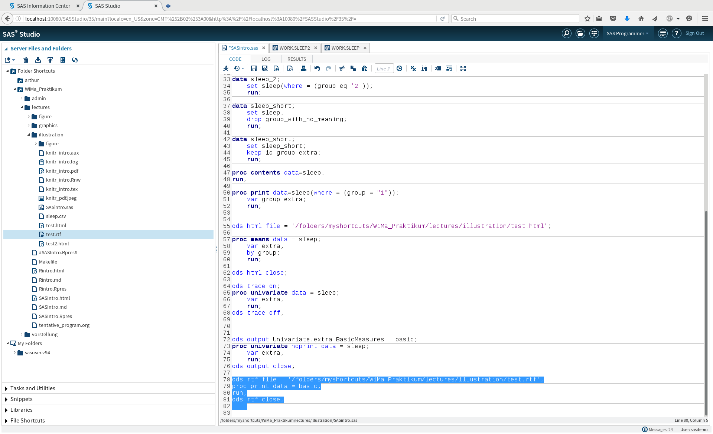
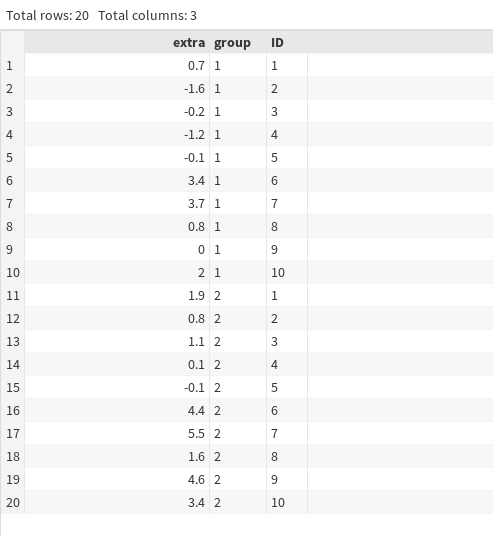
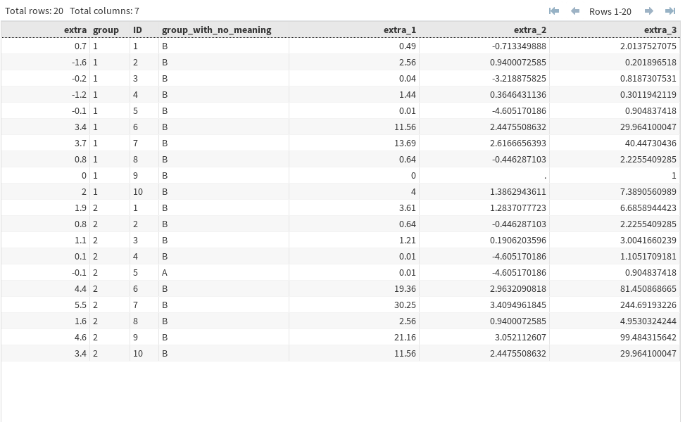

# Introduction #

## What is SAS ##

- Developed in the early 1970s
- Used to stand for "Statistical Analysis System"
- Still a (the) prominent player in the industry

Pros and cons (according to myself)

- Good data handling (especially big data)
- Rich documention
- Decent IDE
- Expensive
- Awful graphics (without giving more $$)
- Awful lot of outputs
- Real programming cumbersome (SAS developed in a time when there were
  still punchcards)
  
## What is SAS ##

> You must realize that R is written by experts in statistics and
> statistical computing who, despite popular opinion, do not believe
> that everything in SAS and SPSS is worth copying. Some things done in
> such packages, which trace their roots back to the days of punched
> cards and magnetic tape when fitting a single linear model may take
> several days because your first 5 attempts failed due to syntax errors
> in the JCL or the SAS code, still reflect the approach of "give me
> every possible statistic that could be calculated from this model,
> whether or not it makes sense". The approach taken in R is
> different. The underlying assumption is that the useR is thinking
> about the analysis while doing it.

Douglas Bates

## Basic structure of a SAS program  ##

Two main components to most SAS programs

i) The data step(s): 
	- reads data from external sources, manipulates and combines it with
	  other data sets
ii) The procedure step(s): 
	- The procedure steps perform the analysis on the data, and produce
	  (often huge amounts of) output.

- SAS is not case-sensitive (contrary to R)
- Missing values represented by a period (`.`)
- Each statement in SAS must end in a semicolon

## SAS IDE ##



# Read data #

## proc import ##

```SAS
proc import datafile='/folders/myshortcuts/WiMa_Praktikum/lectures/illustration/sleep.csv'
	out=sleep
	dbms=csv
	replace;
run;
```

- `datafile` specifies the path to the data set
- `out`: name of the data set in SAS
- `dbms`: file type
- `replace` replace the `sleep` data set if `proc import` is rerun 
- The `run;` command signals to SAS that the previous commands can be
  executed 


## proc import ##



## Import data in a data step ##

```SAS
data sleep2;
    infile '/folders/myshortcuts/WiMa_Praktikum/lectures/illustration/sleep.csv'
    dsd
    delimiter = ','
    firstobs = 2;
input extra group id;

```

- `infile` specifies where the file is
- `dsd` is an option to handle missing values, e.g., `30,,40,50`
- `delimiter` specifies how the data are separated, in this case with
  a `,`
- `firstobs` tells SAS to start reading the data at the 2nd line
- The `input` statement gives the variable names

  
# The data step #

## Introduction ##

Data steps are made up of programming statements, e.g., 

- Assignment
- conditional operations
- subsetting

The Data step always begin with the keyword `data` followed by the
name you want to give to the resulting data set

- Optionally the `set` statement permits to process an existing data
  set


## Operators ##

Arithmetic operators

----   ----------------  ----   --------------  -----  -----------
`*`    multiplication    `+`    addition        `/`    division
`-`    subtraction       `**`   exponentiation
----   ----------------  ----   --------------  -----  -----------

Comparison operators

-----------   -------------   -------------   --------------------------
`=` or `eq`   equal to        `^=` or `ne`    not equal to
`>` or `gt`   greater then    `>=` or `ge`    greater than or equal to
`<` or `lt`   less than       `<=` or `le`    less than or equal to
-----------   -------------   -------------   --------------------------

Boolean Operators

------------   ----  ------------  ---- -------------  ----------
`&` or `and`   and   `|` or `or`   or   `^` or `not`   negations
------------   ----  ------------  ---- -------------  ----------

## Assignment ##

Assignment statement assign values to new or existing variables. These
values may be 

- A constant
- Another variable
- The results of mathematical expressions

```
data sleep;
	set sleep;
	a_variable = 2;
	extra_1 = extra ** 2;
	extra_2 = log(extra_1);
	extra_3 = exp(extra);
	run;

```

## Conditional operations ##

``` 
data sleep;
	set sleep;
	if extra < 0 and group eq 2 then group_with_no_meaning = 'A';
	else group_with_no_meaning = 'B';
run;
```




## Subsetting ##

Subsetting if

```
data sleep_1;
	set sleep;
	if group eq 1 then delete;
	run;
```

`where` statement

```
data sleep_2;
	set sleep(where = (group eq '2'));
	run;
```

`drop` or `keep` variables

```
data sleep_short;
	set sleep;
	drop group_with_no_meaning;
	run;
```

```
data sleep_short;
	set sleep_short;
	keep id group extra;
	run;
```

# SAS procedures #

## SAS procedures ##

SAS procedures begin with the keyword `proc` followed by the name of
the procedure and the name of the data you want to use in the
procedure. 

```
proc contents data=sleep;
run;
```


## SAS procedures ##

```
proc print data=sleep(where = (group = "1"));
	var group extra;
	run;
```


# Output delivery System (ODS)#

## What is ODS ##

To provide more flexibility in producing outputs, SAS introduced the
ODS. Output can be produced in the following format

- SAS data set (`OUTPUT`)
- Normal listing (`LISTING`)
- Postscript (`PRINTER`)
- PDF (`PDF`)
- HTML (`HTML`)
- RTF (`RTF`)

Procedures produce ODS objects (find their names using the help pages
or `ODS TRACE ON`

## An example ##

```
ods html file = 'test.html';

proc means data = sleep;
	var extra;
	by group;
	run;
	
ods html close;
```

## Only output a part of the results ##

First search what you want with `ods trace on`

```
ods trace on;
proc univariate data = sleep;
	var extra;
	run;
ods trace off;
```

then output the part you want

```
ods output Univariate.extra.BasicMeasures = basic;
proc univariate data = sleep;
	var extra;
	run;
```

and print to a file

```
ods rtf file = '/folders/myshortcuts/WiMa_Praktikum/lectures/illustration/test.rtf';
proc print data = basic;
run;
ods rtf close;
```
