# Illustrations #

## USmelanoma: Malignant Melanoma in the USA ##

Fisher and Belle (1993) report mortality rates due to malignant
melanoma of the skin for white males during the period 1950--1969, for
each state on the US mainland. The include the number of deaths due to
malignant melanoma in the corresponding state, the longitude and
latitude of the geographic centre of each state, and a binary variable
indicating contiguity to an ocean, that is, if the state borders one
of the oceans.  

Questions of interest about these data include: 

- how do the mortality rates compare for ocean and non-ocean states? 
- how are mortality rates affected by latitude and longitude?

## USmelanoma: Malignant Melanoma in the USA ##


```r
USmelanoma$Mortality_150 <- factor(as.numeric(USmelanoma$mortality > 150), labels = c("Mortality <= 150", "Mortality > 150"))

head(USmelanoma, n = 4)
```

```
           mortality latitude longitude ocean   Mortality_150
Alabama          219     33.0      87.0   yes Mortality > 150
Arizona          160     34.5     112.0    no Mortality > 150
Arkansas         170     35.0      92.5    no Mortality > 150
California       182     37.5     119.5   yes Mortality > 150
```

In SAS

```
proc import datafile= '/folders/myshortcuts/WiMa_Praktikum/lectures/illustration/USmelanoma.csv'
    out = USmelanoma
    dbms = csv
    replace;
run;

data usmelanoma;
	set usmelanoma;
	label Mortality="Mortality rate due to melanoma";
	mortality_150 = mortality <= 150;
	ocean_bin = ocean eq 'no';
	run;
	
proc format;
	value mort 0="Mortality rate > than 150" 1="Mortality rate <= than 150";
	value oce 0="Contiguous to an ocean" 1="non-contiguous to an ocean";
	run;
```

## Old Faithful geyser waiting times between two eruptions ##

Old Faithful is the most popular attraction of Yellowstone National
Park, although it is not the largest or grandest geyser in the
park. Old Faithful can vary in height from 100--180 feet with an
average near 130--140 feet.  Eruptions normally last between $1.5$ to
$5$ minutes.  From August 1 to August 15, 1985, Old Faithful was
observed and the waiting times between successive eruptions
noted. There were $300$ eruptions observed, so $299$ waiting times
were (in minutes) recorded.


```r
head(faithful)
```

```
  eruptions waiting
1     3.600      79
2     1.800      54
3     3.333      74
4     2.283      62
5     4.533      85
6     2.883      55
```

- `eruptions`: Eruption time in mins
- `waiting`: Waiting time to next eruption (in mins) 

## Survival of Titanic passenger ##

This data set provides information on the fate of passengers on
the fatal maiden voyage of the ocean liner ‘Titanic’, summarised
according to economic status (class), sex, age and survival.

- `Class`: 1st, 2nd, 3rd, Crew 
- `Sex`: Male, Female
- `Age`: Child, Adult
- `Survived`:  No, Yes

## Survival of Titanic passenger ##


```r
Titanic
```

```
, , Age = Child, Survived = No

      Sex
Class  Male Female
  1st     0      0
  2nd     0      0
  3rd    35     17
  Crew    0      0

, , Age = Adult, Survived = No

      Sex
Class  Male Female
  1st   118      4
  2nd   154     13
  3rd   387     89
  Crew  670      3

, , Age = Child, Survived = Yes

      Sex
Class  Male Female
  1st     5      1
  2nd    11     13
  3rd    13     14
  Crew    0      0

, , Age = Adult, Survived = Yes

      Sex
Class  Male Female
  1st    57    140
  2nd    14     80
  3rd    75     76
  Crew  192     20
```


# One continuous variable #

## Summary statistics ##

$\mathbf{X} = (X_1, X_2, \dots, X_n)$ i.i.d random variable

- sample mean: $\hat{\mu} = \frac{1}{n}\sum_{i = 1}^n X_i$
- sample variance: $\hat{\sigma}^2 = \frac{1}{n - 1}\sum_{i = 1}^n (X_i - \hat{\mu})^2$
- Standard deviation: $\sqrt{\hat{\sigma}^2}$
- Median, quantiles
- Minimum, Maximum

In R: 


```r
summary(USmelanoma$mortality)
```

```
   Min. 1st Qu.  Median    Mean 3rd Qu.    Max. 
   86.0   128.0   147.0   152.9   178.0   229.0 
```

In SAS

```
proc means data = usmelanoma mean std clm median q1 q3 min max maxdec=2;
	var mortality;
run;
```


## Histograms ##

Histograms are used for counting and displaying the distribution of a
variable. Histograms can often be misleading for displaying
distributions because of their dependence on the number of classes
chosen.


```r
ggplot(USmelanoma, aes(x = mortality)) + geom_histogram()
```

```
`stat_bin()` using `bins = 30`. Pick better value with `binwidth`.
```

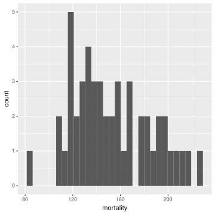

## Histograms ##


```r
ggplot(USmelanoma, aes(x = mortality)) + geom_histogram(binwidth = 60)
```


## Boxplot ##


```r
ggplot(USmelanoma, aes(x = 1, y = mortality)) + geom_boxplot()
```

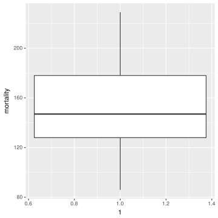

- Middle line is the **median**
- The lower and upper "hinges" correspond to the **first** and
  **third quartiles** (the 25th and 75th percentiles)
- The lower/upper whiskers extends from the hinges to the
  lowest/highest value within **1.5 * IQR** (interquartile range) of the
  hinge. Data beyond the end of the whiskers are **outliers** and plotted
  as **points**

## Density estimation ##

The goal of density estimation is to approximate the probability
density function of a random variable (univariate or multivariate)
given a sample of observations of the variable. 

If we are willing to assume a particular form for the variable
distribution, for example, Gaussian, density estimation would
be reduced to estimating the parameters of the distribution.
More commonly, however, we wish to allow the data to speak for
themselves and so one of a variety of non-parametric estimation
procedures that are now available might be used. 

One of the most popular class of procedures is the kernel density
estimators.

## Kernel density estimation ##

From the definition of a probability density, if the r.v $X$ has a
density $f$,

$$f(x) = \lim_{h \rightarrow 0} \frac{1}{2h} P(x - h < X < x + h).$$

For any given $h$ a naïve estimator is 

$$\hat{f}(x) = \frac{1}{2hn} \sum_{i = 1}^n I(x_i \in (x - h, x + h)),$$

i.e., the number of $x_1, \dots, x_n$ falling in the interval $(x - h, x +h)$ 
divided by $2hn$. 


## Kernel density estimation ##

$$\hat{f}(x) = \frac{1}{hn} \sum_{i = 1}^n K\left(\frac{x - x_i}{h}\right)$$

where $K$ is known as the **kernel function**
and $h$ as the **bandwidth** or **smoothing parameter**.

The kernel function must satisfy the condition

$$\int_{-\infty}^\infty K(x)dx = 1.$$

Usually, but not always, the kernel function will be a symmetric
density function for example, the normal.

## Kernel density estimation ##

3 types of Kernel functions

- Rectangular
- Triangular
- Gaussian


The kernel estimator $\hat{f}$ is a sum of 'bumps' placed at the
observations. The kernel function determines the shape of the bumps
while the window width $h$ determines their width.


## Kernel density estimation ##

The `adjust` argument controls the bandwidth 


```r
ggplot(faithful, aes(waiting)) +
  geom_line(stat = "density", adjust = .25, col = "red") +
  geom_line(stat = "density", adjust = 1, col = "black") +
  geom_line(stat = "density", adjust = 5, col = "blue")
```


## Kernel density estimation ##

The `kernel` argument specifies which kernel to use


```r
ggplot(faithful, aes(waiting)) +
  geom_line(stat = "density", adjust = 1, col = "black", kernel = "gaussian") +
  geom_line(stat = "density", adjust = 1, col = "red", kernel = "rectangular") +
  geom_line(stat = "density", adjust = 1, col = "blue", kernel = "triangular") 
```


## Display the density ##


```r
ggplot(faithful, aes(x = waiting)) + geom_histogram()
```

```
`stat_bin()` using `bins = 30`. Pick better value with `binwidth`.
```

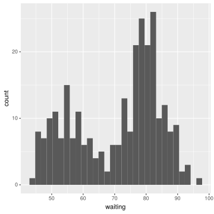

## Display the density ##


```r
ggplot(faithful, aes(waiting)) + 
  geom_histogram(aes(y = ..density..), colour="black", fill="white") +
  geom_density(fill = "red", alpha = .2)
```

```
`stat_bin()` using `bins = 30`. Pick better value with `binwidth`.
```


## Display the density ##

**Violin plot**: a boxplot with a rotated kernel density plot on each side


```r
ggplot(faithful, aes(1, waiting)) +
  geom_violin(draw_quantiles = c(0.25, 0.5, 0.75))
```

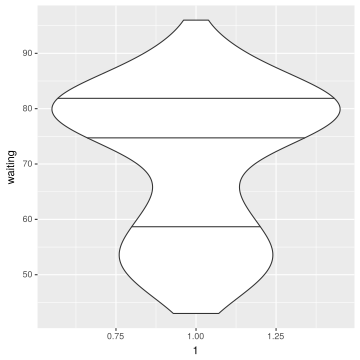

# One binary variable #

## Possible display &mdash; Bars ##


```r
ggplot(USmelanoma, aes(ocean)) + geom_bar()
```

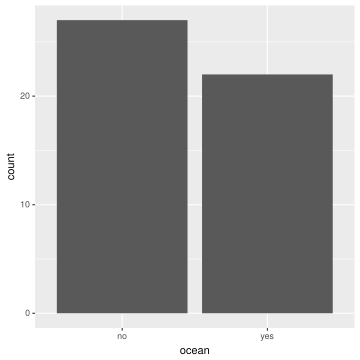

## Possible display &mdash; Dotchart ##


```r
df <- USmelanoma %>% group_by(ocean) %>% summarise(n = n())
ggplot(df, aes(ocean, n)) + geom_point(size = 5) + coord_flip()
```

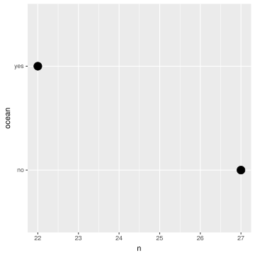

## Inference for a single proportion ##

A sample proportion can be described as a sample mean, e.g, if
'successes' are coded as 1,then the sample proportion is the mean of
these numerical outcomes

$$\hat{p} = \frac{\text{Number of successes}}{n}$$

with n the total number of observation.

If $np \geq 10$ and $n(1-p) \geq 10$ then the standard error (SE) of
$\hat{p}$ can be computed as

$$\sqrt{\frac{p(1-p)}{n}}$$

## Inference for a single proportion ##

In SAS:

```
proc freq data = usmelanoma;
	format mortality_150 mort.;
	tables mortality_150 / nocum binomial alpha = 0.05;
run;
```


# One binary variable VS one continuous variable #

## Mortality rates for ocean and non-ocean states compared ##


```r
ggplot(USmelanoma, aes(x = ocean, y = mortality)) + geom_boxplot() +
  xlab("Contiguity to an ocean") +
  ylab("Mortality rates")
```

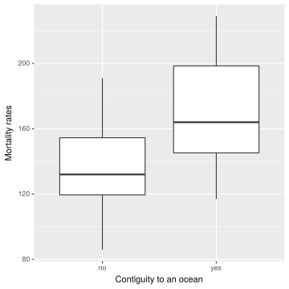

## Mortality rates for ocean and non-ocean states compared ##


```r
ggplot(USmelanoma, aes(x = mortality, fill = ocean)) + geom_histogram()
```

```
`stat_bin()` using `bins = 30`. Pick better value with `binwidth`.
```

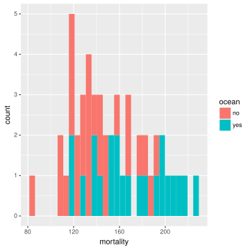


## Mortality rates for ocean and non-ocean states compared ##


```r
ci <- function(x) {
    n <- length(x)
    se <- sd(x)/sqrt(n)
    se * qt(.975, n - 1)
}
    
df <- USmelanoma %>% group_by(ocean) %>% summarise(mean = mean(mortality),
                                                   sd = sd(mortality),
                                                   ciMult = ci(mortality))                                                 
```


```r
ggplot(df, aes(x = ocean, y = mean, fill = ocean)) + geom_bar(stat = "identity", width = .5) +
  geom_errorbar(aes(ymin = mean - ciMult, ymax = mean + ciMult), width = .2)
```


## Mortality rates for ocean and non-ocean states compared ##


```r
ggplot(USmelanoma, aes(x = mortality)) + geom_histogram() +
  facet_grid(.~ ocean)
```

```
`stat_bin()` using `bins = 30`. Pick better value with `binwidth`.
```

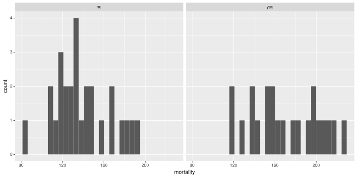


## Comparing Normal Populations ##

The independent samples $t$-test is used to test the null hypothesis
that the means of two populations are the same: $H_0: \mu_1 = \mu_2$.

The variable to be compared is assumed to have a normal
distribution with the same variance in both populations. 

Test statistic:
$$t = \frac{\bar{x}_1 - \bar{x}_2}{s \sqrt{1 / n_1 + 1 / n_2}} \sim t_{n_1 + n_2 - 2}$$

## Comparing Normal Populations ##

**In R**


```r
t.test(mortality ~ ocean, data = USmelanoma, var.equal= TRUE)
```

```

	Two Sample t-test

data:  mortality by ocean
t = -3.684, df = 47, p-value = 0.0005924
alternative hypothesis: true difference in means is not equal to 0
95 percent confidence interval:
 -48.68041 -14.29265
sample estimates:
 mean in group no mean in group yes 
         138.7407          170.2273 
```

## Comparing Normal Populations ##

**Unequal Variances:**

If the two populations are suspected of having different variances
(boxes in boxplots differ significantly), a modified form of the $t$
statistic, known as the Welch test, may be used:

$$t = \frac{\bar{x}_1 - \bar{x}_2}{\sqrt{s_1^2 / n_1 + s_2^2 / n_2}} \sim t_\nu,$$

where

$$\nu = \left(\frac{c}{n_1 - 1} + \frac{(1 - c)^2}{n_2 - 1}\right)^{-1}$$

and 

$$c = \frac{s_1^2/n_1}{s_1^2/n_1 + s_2^2/n_2}$$

## Comparing Normal Populations &mdash; Unequal Variances ##

**In R**


```r
t.test(mortality ~ ocean, data = USmelanoma, var.equal= FALSE)
```

```

	Welch Two Sample t-test

data:  mortality by ocean
t = -3.5963, df = 39.539, p-value = 0.0008859
alternative hypothesis: true difference in means is not equal to 0
95 percent confidence interval:
 -49.18811 -13.78495
sample estimates:
 mean in group no mean in group yes 
         138.7407          170.2273 
```

## Comparing Normal Populations ##

**In SAS**

```
proc ttest data = usmelanoma;
	format ocean_bin oce.;
	class ocean_bin;
	var mortality;
run;	
```


## Paired samples ##

A paired $t$-test is used to compare the means of two populations
when samples from the populations are available, in which each
individual in one sample is paired with an individual in the
other sample or each individual in the sample is observed twice.

If the values of the variable of interest, $x$,
for the members of the $i$th pair in groups $1$ and $2$ are denoted
as $x_{1i}$ and $x_{2i}$, then the differences $d_i = x_{1i} - x_{2i}$ are
assumed to have a normal distribution with mean $\mu$ and the null
hypothesis here is that the mean difference is zero, i.e., $H_0: \mu = 0$.

The paired $t$-statistic is

$$t = \frac{\bar{d}}{s / \sqrt{n}} \sim t_{n-1}$$


## Non-parametric tests ##

**Wilcoxon-Mann-Whitney Test**

For two independent groups, the Wilcoxon Mann-Whitney
rank sum test applies the $t$-statistic to the joint ranks of all
measurements in both groups instead of the original measurements. The null
hypothesis to be tested is that the two populations
being compared have identical distributions. 

**Wilcoxon-Signed-Rank Test**

The Wilcoxon
signed-rank statistic is based on the ranks of the absolute differences $|d_i|$. The
statistic is defined as the sum of the ranks associated with positive
difference $d_i > 0$. 

It should be noted that this test is only valid when the differences $d_i$ are
symmetrically distributed.

## Non-parametric tests ##

Use a nonparametric test when:

- The data are not normally distributed or are ordinal
- There is outliers: As the test compares sum of ranks, it is less
  likely than the t-test to spuriously indicate significance because
  of the presence of outliers
- Even if normality holds, the Wilcoxon test is not a lot less efficient

## Non-parametric tests ##

**In R:**


```r
wilcox.test(mortality ~ ocean, USmelanoma)
```

```
Warning in wilcox.test.default(x = c(160L, 170L, 149L, 177L, 116L, 124L, :
cannot compute exact p-value with ties
```

```

	Wilcoxon rank sum test with continuity correction

data:  mortality by ocean
W = 134.5, p-value = 0.001125
alternative hypothesis: true location shift is not equal to 0
```

**In SAS**

```
proc npar1way data = usmelanoma;
	format ocean_bin oce.;
	class ocean_bin;
	var mortality;
run;

* Only a wilcoxon test;
proc npar1way wilcoxon plots=none data = usmelanoma;
	format ocean_bin oce.;
	class ocean_bin;
	var mortality;
run;
```

# Two binary variables #

## Survival of Titanic passenger ##


```r
dt <- data.table(Titanic)
survived_gender <- dt[, list(n = sum(N)), by = list(Sex, Survived)]
survived_gender[, N := sum(n), by = Sex]
survived_gender[, prop := n/N]
survived_gender
```

```
      Sex Survived    n    N      prop
1:   Male       No 1364 1731 0.7879838
2: Female       No  126  470 0.2680851
3:   Male      Yes  367 1731 0.2120162
4: Female      Yes  344  470 0.7319149
```

## Survival of Titanic passenger ##


```r
ggplot(survived_gender, aes(Sex, prop, fill = Survived)) + geom_bar(stat = "identity")
```

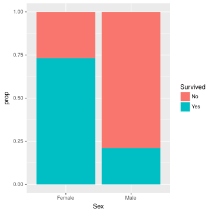

## Survival of Titanic passenger ##


```r
ggplot(survived_gender, aes(Sex, prop, fill = Survived)) +
  geom_bar(stat = "identity", position = "dodge")
```


## Survival of Titanic passenger ##


```r
ggplot(survived_gender, aes(prop, Sex, colour = Survived)) +
  geom_point(size = 6)
```

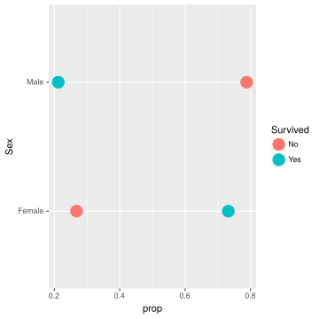

## Contingency tables ##

- In R: see `table`

- In SAS:

```
proc freq data = usmelanoma;
	format mortality_150 mort. ocean_bin oce.;
	tables ocean_bin * mortality_150;
run;
```

## Test of independence ##

**$\chi^2$-Test:**

Under the null hypothesis of independence of the row variable $x$ and
the column variable $y$, estimated expected values $E_{jk}$ for cell
$(j, k)$ can be computed from the corresponding margin totals $E_{jk}
= n_{j\cdot} n_{\cdot k} / n$. The test statistic is

$$X^2 = \sum_{j = 1}^r \sum_{k = 1}^c \frac{(n_{jk} - E_{jk})^2}{E_{jk}} \sim \chi^2_{(r-1)(c-1)}$$

with $rc$ the number of cells

*Assumptions:*

- A sufficiently large sample size is assumed
- Adequate expected cell counts (5 or more)

## Test of independence ##

**$\chi^2$-Test:**

- In R:


```r
with(USmelanoma, chisq.test(table(Mortality_150, ocean)))
```

```

	Pearson's Chi-squared test with Yates' continuity correction

data:  table(Mortality_150, ocean)
X-squared = 8.8647, df = 1, p-value = 0.002907
```

- In SAS:

```
proc freq data = usmelanoma;
	format mortality_150 mort. ocean_bin oce.;
	tables ocean_bin * mortality_150 / chisq;
run;
```

## Test of independence ##

**Fisher's exact test**

The Fisher's exact test calculates the *exact probability* of the
table of observed cell frequencies given the following assumptions:

- The null hypothesis of independence is true
- The marginal totals of the observed table are fixed

If margins of a table are fixed, the exact probability of a table with
cells $a, b, c, d$ and marginal totals $(a+b), (c+d), (a+c), (b+d)$ is 

$$\frac{(a + b)! \times (c+d)! \times (a+c)! \times (b+d)!}{n!\times a! \times b! \times c! \times d!}$$

Then compute all possible tables with the given marginals. The p-value
for the Fisher’s exact test is calculated by summing all probabilities
less than or equal to the probability of the observed table

## Test of independence ##

**Fisher's exact test**


```r
with(USmelanoma, fisher.test(table(Mortality_150, ocean)))
```

```

	Fisher's Exact Test for Count Data

data:  table(Mortality_150, ocean)
p-value = 0.001583
alternative hypothesis: true odds ratio is not equal to 1
95 percent confidence interval:
  1.831364 33.265732
sample estimates:
odds ratio 
  7.254566 
```

- In SAS:

```
proc freq data = usmelanoma;
	format mortality_150 mort. ocean_bin oce.;
	tables ocean_bin * mortality_150 / chisq;
run;
```


## Odds-ratio and relative risk ##

|             | Diseased | Non-diseased | Total   |
|-------------+----------+--------------+---------|
| Exposed     | a        | b            | a+b     |
| Non-exposed | c        | d            | c+d     |
| Total       | a+c      | b+d          | a+b+c+d |


**Relative risk:**

The is the ratio of the probability of an event occurring

$$\text{RR} = \frac{a/(a+b)}{c/(c+d)} = \frac{\pi_1}{\pi_2}$$

Exposed would be $\text{RR}$ times as likely to develop the disease. Note
that the $\text{RR}$ is not suitable for case-control studies
  
**Odds ratio:**

The odds ratio is computed as

$$\text{OR} = \frac{\pi_1/(1-\pi_1)}{\pi_2/(1-\pi_2)} = \frac{a/c}{b/d} = \frac{ad}{cb}$$
  
- Testing $\text{OR} = 1$ is equivalent to an independence test
- The odds ratio does not change when the orientation of the table
  reverses
- $\text{se}(\log \text{OR}) = \sqrt{1/a + 1/b + 1/c + 1/d}$

## Odds-ratio and relative risk ##

- In R: Compute per hand or 


```r
ft <- with(USmelanoma, fisher.test(table(Mortality_150, ocean)))
(or <- ft$estimate)
```

```
odds ratio 
  7.254566 
```

```r
## Note that this OR is estimated via maximum likelood
```

- In SAS

```
proc freq data = usmelanoma;
	format mortality_150 mort. ocean_bin oce.;
	tables ocean_bin*mortality_150 / relrisk;
run;
```

# 2 Continuous variables #

## Scatterplot ##

Mortality rate against latitude and longitude in the `USmelanoma` data


```r
p <- ggplot(USmelanoma, aes(x = longitude, y = mortality)) + geom_point(size = 2)
q <- ggplot(USmelanoma, aes(x = latitude, y = mortality)) + geom_point(size = 2)

grid.arrange(p, q, ncol = 2)
```

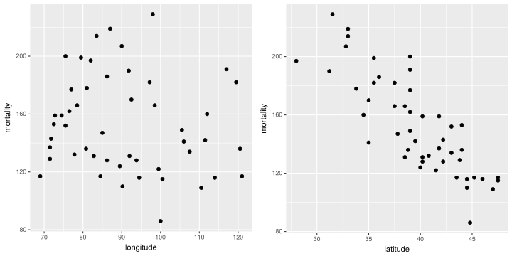

## Testing Correlation ##

**Pearson's correlation coefficient:**

$$\rho = \text{corr}(X,Y) = \frac{\text{cov}(X,Y)}{\sigma_X\sigma_Y}$$

The Pearson correlation is +1 in the case of a perfect direct
(increasing) linear relationship (correlation), -1 in the case of a
perfect decreasing (inverse) linear relationship. Note that this
coefficient only detects **linear relationships**.

- in R


```r
cor.test(~ mortality + latitude, USmelanoma)
```

```

	Pearson's product-moment correlation

data:  mortality and latitude
t = -9.9898, df = 47, p-value = 3.309e-13
alternative hypothesis: true correlation is not equal to 0
95 percent confidence interval:
 -0.8976036 -0.7073128
sample estimates:
       cor 
-0.8245178 
```

```r
cor.test(~ mortality + longitude, USmelanoma)$p.value
```

```
[1] 0.3162
```

- in SAS


## Testing Correlation ##

**Spearman's rho:**

The Spearman correlation coefficient is defined as the Pearson
correlation coefficient between the ranked variables

$$\rho_{X,Y} = \frac{\text{cov}(\text{rg}_X,\text{rg}_Y)}{\sigma_{\text{rg}_X}\sigma_{\text{rg}_Y}}$$

- $\text{cov}(\text{rg}_X,\text{rg}_Y)$ is the covariance of the rank variables
- $\sigma_{\text{rg}_X}$ and $\sigma_{\text{rg}_Y}$ are the standard
  deviations of the rank variables

## Testing Correlation ##

**Spearman's rho:**


```r
ggplot(USmelanoma[USmelanoma$ocean == "no", ],  aes(x = latitude, y = mortality)) +
  geom_point(size = 2)
```


## Testing Correlation ##

**Spearman's rho:**


```r
cor.test(~ mortality + latitude, USmelanoma[USmelanoma$ocean == "no", ], method = "pearson")
```

```

	Pearson's product-moment correlation

data:  mortality and latitude
t = -6.0679, df = 25, p-value = 2.432e-06
alternative hypothesis: true correlation is not equal to 0
95 percent confidence interval:
 -0.8905788 -0.5542985
sample estimates:
       cor 
-0.7717501 
```

```r
cor.test(~ mortality + latitude, USmelanoma[USmelanoma$ocean == "no", ], method = "spearman")
```

```
Warning in cor.test.default(x = c(160L, 170L, 149L, 177L, 116L, 124L,
128L, : Cannot compute exact p-value with ties
```

```

	Spearman's rank correlation rho

data:  mortality and latitude
S = 6051.7, p-value = 2.484e-08
alternative hypothesis: true rho is not equal to 0
sample estimates:
       rho 
-0.8472713 
```

## Testing Correlation ##

```
proc corr pearson spearman data = usmelanoma;
	where ocean eq "no";
	var mortality latitude;
run;
```

# Graphical analysis for more than one variable #

## Mortality rates by latitude ##


```r
ggplot(USmelanoma, aes(x = latitude, y = mortality, colour = ocean)) +
  geom_point(size = 2)
```


## Mortality rates by latitude ##


```r
ggplot(USmelanoma, aes(x = latitude, y = mortality)) +
  geom_point(size = 2) +
  facet_grid(. ~ ocean)
```

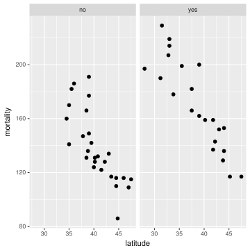

## Mortality rates by latitude ##


```r
ggplot(USmelanoma, aes(x = latitude, y = mortality, colour = ocean, size = longitude)) +
  geom_point()
```


## Mosaic plot for categorical data ##


```r
mosaicplot(~ Sex + Class + Survived, Titanic,
           main = "Survival on the Titanic",
           col = hcl(c(240, 120)),
           off = c(5, 5, 5, 5))
```


