# Illustration #

## Illustration ##

Fake data set `df.csv` 

```
proc import datafile = '/folders/myshortcuts/WiMa_Praktikum/lectures/illustration/df.csv'
    out = df
    dbms = csv
    replace;
run;

proc print data = df(obs = 5);
run;
```

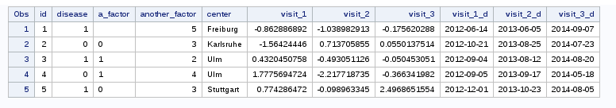

## Illustration ##

```
proc contents data = df;
run;
```


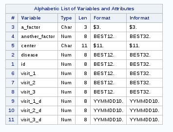

- Need to change the format of `a_factor` to numeric

```
data df;
    set df;
    newfactor = input(a_factor, 3.);
run;
```

# SAS Labels #

## Labelling ##

- Both variables and values can be labelled
- Once created, these labels will appear in the output of statistical
  procedures
	  - Nicer and clearer output
	  
## Labels for variables ##

```
data df;
	set df;
	label visit_1 = "Measure at first visit (mm)"
		visit_2 = "Measure at second visit (mm)"
		visit_3 = "Measure at third visit (mm)";
run;

proc means data = df;
var visit_1 visit_2 visit_3;
run;
```

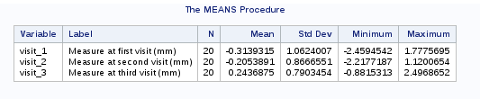

## Labels for values ##

Specified through creating new formats

``` 
proc format;
    value dis 1 = 'Horrible disease' 0='Healthy';
    value factor_one 1 = 'Factor present' 0 = 'Factor absent';
    value factor_two 1-2='low' 3 = 'medium' 4-5 = 'high';
run;

* an example in proc freq;
proc freq data = df;
    format disease dis. another_factor factor_two.;
    tables disease * another_factor;
run;
```

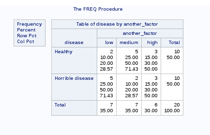

# Dates #

## Dates and times ##

SAS handles 3 types of date and time values

- Time values (*internal*: Number of seconds since midnight)
- Date values (*internal*: Number of days since 1.1.1970)
- Datetime values (*internal*: Number of seconds since 1.1.1970)

**Example:** Create some dates and times. Note that a `proc print` will
display the internal representation

```
data some_dates;
    time1 = '15:00't;
    date1 = '18jun2016'd;
    datetime1 = '3nov1995:15:00:00'dt;
run;
```

## Format for dates and times ##

```
data test_date;
    time1 = 1090013;  format time1  datetime.;
    date1 = 9013;    format date1  date9.;
    time2 = time1;    format time2  timeampm.;
    date2 = date1;    format date2  month.;
    date3 = date1;    format date3  DDMMYYB10.;
    
    new_date = date1 - 360; * math operation work with dates;
    new_date0 = new_date; format new_date0 date9.;
    new_date2 = month(new_date);	* extract month;
    
run;
```

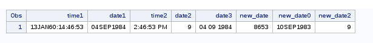

# Text processing #

## Concatenate ##

------  ---------------------------------------------
`cat`   preserve all spaces
`cats`  remove trailing blanks
`catt`  remove all blanks
`catx`  join with a separator (first argument)
------  ---------------------------------------------

```
data text1;
    x1 = 'cats ';
    x2 = ' apples';
    x3 = 'and dogs';

    all1 = cat(of x1-x3); /* same as cat(x1, x2, x3) */
    all2 = cats(of x1-x3);
    all3 = catt(of x1-x3);
    all4 = catx("|", of x1-x3);

    put all1=;
    put all2=;
    put all3=;
    put all4=;
run;
```

```
all1=cats  applesand dogs
all2=catsapplesand dogs
all3=cats applesand dogs
all4=cats|apples|and dogs
```

## Remove characters ##

```
data text2;
    expr1 = 'A; simple; sentence';
    new = compress(expr1, ";");
    put new=;

    expr2 = '122-ll43 76';
    new2 = compress(expr2, "-", 'd'); * remove '-' and any digit;
    put new2=;

    expr3 = '1   2   4   5     7';
    new3 = compress(expr3, , 's'); * Remove spaces;
    put new3=;
run;
```

```
new=A simple sentence
new2=ll
new3=12457
```

## Simple match and replacement ##

```
data text3;
    a = count("banana", "a"); * count the number of a's;
    put a=;

    where = "university of california"; * Position of 'cal' in the string;
    i = index(where,"cal");
    put i=;

    hihi = reverse(where); 
    put hihi=;

    up = upcase(where); 
    put up=;

    new = translate(where, 'UC', 'uc'); * Change u's and c's into U's and C's 
    put new=;

	new2 = tranwrd(where, 'university', 'beach'); * Replace words;
    put new2=;
run;
```

```
a=3
i=15
hihi=ainrofilac fo ytisrevinu
up=UNIVERSITY OF CALIFORNIA
new=University of California
new2=beach of california
```

# Data manipulation #

## Row subscripting ##

- With a condition

```
data ulm;
	set df;
	if upcase(center) eq 'ULM' then delete;
run;
```

- `where` statement

```
data high;
	set df(where = (another_factor in (4 5)));
run;
```

## Column subscripting ##

- `Keep` every variables starting with `visit` (`:` is a *wildcard*)

``` 
data visit;
	set df;
	keep visit:;
run;
```

- Drop every variables between `id` and `center`

```
data visit2;
	set df;
	drop id--center;
run;
```

- Keep only numeric variables

```
data numeric;
	set df;
	keep id-numeric-visit_3_d;
run;
```

## Column subscripting ##

- Keep character variables

```
data char;
	set df;
	keep id-character-visit_3_d;
	run;
```

- Remove `visit_1` to `visit_3`

```
data sans_visit;
	set df;
	drop visit_1-visit_3;
run;
```

## proc SQL ##

`proc sql` permits to sort, summarize, subset, join (merge), and concatenate
datasets, create new variables, and print the results or create a new
table or view all in one step.

- A mix of SAS and SQL syntax
- Does not need sorted data sets for merge operations

The command starts with `proc sql` and ends with `quit;` (not `run`)

## Select variables with proc sql ##

Create a data set `new` from `df` containing the variables `visit_1`
to `visit_3`

```
proc sql;
	create table new as
		select visit_1, visit_2, visit_3
		from df
quit;
```

## More complicated ##

Create data set `new_new` based on `df`

- select variable `id` and rename as `pat`
- create `exp_visit` as $\exp(\mbox{visit})$
- select variables `visit_2`, `visit_3` and `visit_1_d` (with format
  change)
- Select only the individuals for which `center` equals `ulm` and `freiburg`
- Finally, order by descending `pat`

```
proc sql;
	create table new_new as
		select id as pat, exp(visit_1) as exp_visit1, visit_2, visit_3, visit_1_d format=date9.
		from df
		where center in ("ulm", "Freiburg")
		order by id desc;
quit;
```

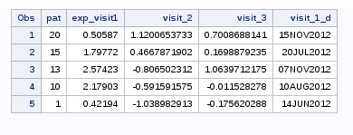

## Array ##

Arrays in SAS permit to perform the same task on a group of variables

```
array arrayname variable_list <$>;
```

1. All the variables in an array must be of the same type
2. An array can not have the same name as a variable
3. You can use the keyword `_temporary_` instead of a variable list

```
data test_array;
	set df;
	array x visit_1-visit_3;
	array res{3};
	do i=1 to dim(x);
		res{i} = x{i} * 10;
		end;
	keep visit_1-visit_3 res:;
run;
```

# Data reshaping #

## proc transpose ##

The name says it all. The problem is that `proc transpose` can only
manage one variable at a time. Thus we need to

- Transpose `visit_X`
- Transpose `visit_X_d`
- Merge back with the whole data set

```
proc transpose data = df
	out = long1(rename=(col1=measure)) name = visit;
	by id;
	var visit_1-visit_3;
run;

proc transpose data = df
	out = long2(rename=(col1=date)) name = visit;
	by id;
	var visit_1_d--visit_3_d;
run;

* and merge;
data df_long;
	merge long1
		  long2
		  df(keep = id a_factor another_factor disease center);
	by id;
run;
```

## Reshape using a data step ##

```
data df_long2;
	set df;
	
	array m visit_1-visit_3;
	array d visit_1_d--visit_3_d;
	
	do _i = 1 to dim(m);
		measure = m(_i);
		date = d(_i);
		visit = _i;
		output;
	end;
	
	format date date9.;
	keep id center a_factor another_factor disease measure date visit;
run;
```

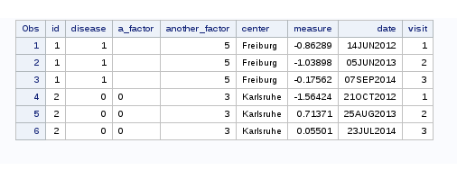

## Always check !!! ##

```
proc means data = df;
	var visit_1-visit_3;
run;
```

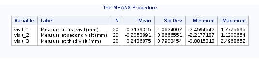


## Always check !!! ##

```
* need to sort before using the by statement in proc means;
proc sort data = df_long
	out = df_long;
	by visit;
proc means data = df_long;
	var measure;
	by visit;
	run;
```

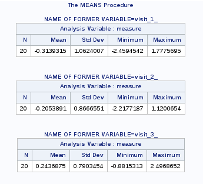

## Always check !!! ##

```
proc sort data = df_long2
	out = df_long2;
	by visit;
proc means data = df_long2;
	var measure;
	by visit;
	run;
```


# Data Merging #

## Combine data by rows

```
data d1;
	input x y $;
	datalines;
	1 a
	4 b
	5 g
	7 y
	;
run;

data d2;
	input x y $;
	datalines;
	6 r
	9 g
	4 j
	6 t
	;
run;
```

Note the $ sign after `y` to specify this variable as character

## Combine data by rows ##

```
data row_bind;
	set d1 d2;
proc print data = row_bind;
run;
```

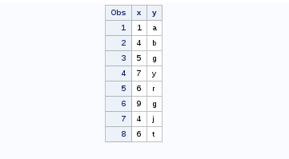

## Combine data by columns ##

We first need to rename the columns of `d2`, otherwise SAS does
nothing

```
data d3;
	set d2(rename=(x=z y=w));
run;
```

## Combine data by columns ##

- Either use 2 `set` statements

```
data col_bind;
	set d1;
	set d3;
run;
```

- Or merge by row numbers (which means, don't specify any variable to
  merge on)

```
data col_bind2;
	merge d1 d3;
run;
```

## Merging ##

```
data dd1;
	input id letter $;
	datalines;
	20 k
	1  j
	3  h
	7  a
	13 c
	8  s
	;
run;

data dd2;
	input id digit;
	datalines;
	13 3
	14 8
	7  7
	1  6
	54 0
	;
run;
```

## Merging ##

Before merging using the `merge` statement, data sets have to be
sorted wrt the variables used for merging

```
proc sort data=dd1
	out=dd1_sort;
	by id;
run;

proc sort data=dd2
	out=dd2_sort;
	by id;
run;
```

## Merging ##

By default SAS performs a full join

```
data ddmerge;
	merge dd1_sort dd2_sort;
	by id;
run;
```

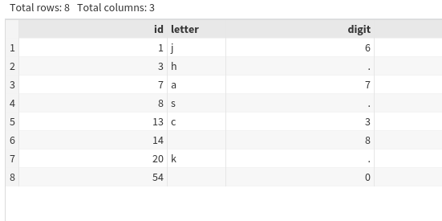

## Merging ##

To perform other types of joins, use the `in=` directive

- That creates temporary variables indicating from which data the
  observations are coming from
  
**Natural join**

```
data ddmerge_natural;
	merge dd1_sort(in=in1) dd2_sort(in=in2);
	by id;
	if in1 eq 0 or in2 eq 0 then delete;
run;
```

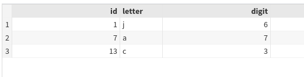

## Merging ##

**Left join**

```
data ddmerge_left;
	merge dd1_sort(in=in1) dd2_sort(in=in2);
	by id;
	if in1 eq 0 then delete;
run;
```

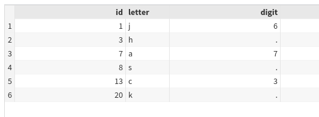

## Merging with proc SQL ##

**Natural join**

```
proc sql;
	create table ddmerge_natural_sql as 
		select *
		from dd1 inner join dd2
		on dd1.id=dd2.id;
quit;
```

- When the variables you join on don't share the same name

```
data dd2_alt;
	set dd2(rename=(id=pat));
run;

proc sql;
	create table ddmerge_natural_sql2 as 
		select *
		from dd1 inner join dd2_alt
		on dd1.id=dd2_alt.pat;
quit;
```

## Merging with proc SQL ##

**Left join**

```
proc sql;
	create table ddmerge_left_sql as
	select *
	from dd1 left join dd2
	on dd1.id=dd2.id;
quit;
```
