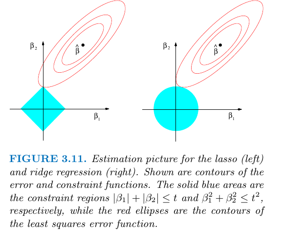

\newcommand{\X}{\mathbf{X}}
\newcommand{\x}{\mathbf{x}}
\newcommand{\Z}{\mathbf{Z}}
\newcommand{\y}{\mathbf{y}}
\newcommand{\be}{\mathbf{b}}
\newcommand{\b}{\boldsymbol\beta}
\newcommand{\ve}{\boldsymbol\varepsilon{}}
\newcommand{\hb}{\hat{\beta}}
\newcommand{\E}{\text{E}}
\newcommand{\P}{\text{Pr}}
\newcommand{\d}{\text{d}}
\newcommand{\var}{\text{var}}
\newcommand{\cov}{\text{cov}}
\newcommand{\cor}{\text{cor}}
\newcommand{\I}{\mathbf{I}}
\DeclareMathOperator*{\argmin}{arg\,min}
\DeclareMathOperator*{\argmax}{arg\,max}

# Introduction #

## Why do we want to choose a model? ##

**Explanation:**

Occam's razor applies and we want 

> an explanation that is as simple as possible, but not simpler
	
**Prediction:**

For prediction, we want a model that predicts well (!) All that
matters is that it works, the model doesn't necessarily need to be
interpretable

## Bias-Variance trade-off ##

Let $Y = f(X) + \varepsilon$, with $\E(\varepsilon) = 0$ and
$\var\varepsilon = \sigma^2_\varepsilon$. The error of a regression
fit $\hat{f}(X)$ at an input point $x_0$ is (using squared error)

$$
\begin{align}
\text{Err}(x_0) &= \E[(Y - \hat{f}(x_0))^2 | X = x_0] \\
&= \sigma^2_\varepsilon + [\E\hat{f}(x_0) - f(x_0)]^2 +
\E[\hat{f}(x_0) - \E\hat{f}(x_0)]^2 \\
&= \sigma^2_\varepsilon + \text{Bias}^2(\hat{f(x_0)}) +
\var(\hat{f}(x_0))\\
&= \text{Irreducible error} + \text{Bias}^2 + \text{Variance}
\end{align}
$$

Typically, the more complex we make the model $\hat{f}$, the lower the
(squared) error but the higher the variance

## Model selection is difficult ##


```r
set.seed(442)
n <- 200
p <- 100
y <- rnorm(n)
x <- matrix(rnorm(n * p), nrow = n)
df <- data.frame(y, x)
mdl <- lm(y ~ ., df)
```

## Model selection is difficult ##


```r
stars <- 1 + which(coefficients(summary(mdl))[-1, 4] < 0.05)
mdl.2 <- lm(y ~ ., df[, c(1, stars)])
summary(mdl.2)
```

```

Call:
lm(formula = y ~ ., data = df[, c(1, stars)])

Residuals:
     Min       1Q   Median       3Q      Max 
-2.56045 -0.73379  0.06531  0.63945  2.83769 

Coefficients:
            Estimate Std. Error t value Pr(>|t|)  
(Intercept)  0.00228    0.07710   0.030   0.9764  
X4          -0.15414    0.07373  -2.090   0.0379 *
X14          0.09399    0.07275   1.292   0.1979  
X40         -0.09558    0.07266  -1.315   0.1899  
X63         -0.17910    0.08089  -2.214   0.0280 *
X65         -0.19684    0.07736  -2.544   0.0117 *
X84         -0.12703    0.07221  -1.759   0.0801 .
X99          0.05094    0.07675   0.664   0.5077  
---
Signif. codes:  0 '***' 0.001 '**' 0.01 '*' 0.05 '.' 0.1 ' ' 1

Residual standard error: 1.048 on 192 degrees of freedom
Multiple R-squared:  0.09739,	Adjusted R-squared:  0.06449 
F-statistic:  2.96 on 7 and 192 DF,  p-value: 0.00573
```

## Model selection is difficult ##

The standard asymptotic formulas for, e.g., standard errors, assume
that the variables included in the model are *prespecified*

- The "phantom degrees of freedom" induced by having a subjective
  assessment of the data is not taken into account
- That leads to, e.g., too narrow confidence intervals &rarr; too
  small p-values

Usual practice is to sweep this problem under the rug

One possible solution is too prespecify all variables in advance
(including non-linear terms, interactions, ...)

- That is the only way to conserve the advertised coverage rates
  without further ado
  
## Otherwise... ##

There is plenty of techniques for performing model selections

- Subsetting methods
- Different criteria for comparing models
- Use models that allow for automatic variable selections, e.g.,
	- Random forest
	- Shrinkage

Inference is still a problem, though. Model selection is an active
area of research

# Model selection Criteria #

## Some model selection criteria ##

**Akaike Information Criterion** (1973)

$$\text{AIC}(M) = -2\log L_M + 2p$$

where $L_M$ is the likelihood of model $M$ and $p$
is the number of parameters

Akaike's rule is to pick the model that minimises the AIC. 

**Schwarz's criterion (BIC: Bayesian Information Criterion)**

$$\text{BIC}(M) = -2\log L_M + p\log n$$

where $n$ is the sample size

The intuition behind these 2 criteria is that 

$$\text{AIC} = \text{bias} + \text{variance}$$


## Some model selection criteria ##

**Mallow's $C_p$ statistic**

For a linear model with $p + 1$ parameters

$$C_p = \frac{1}{n} \sum_i (Y_i - \hat{y}_i)^2 +
\frac{2}{\hat{\sigma}^2}n(p + 1)$$

**Leave-one-out cross-validation**

$$
\text{LOOCV} = \frac{1}{n} \sum_i \left(Y_i - \hat{y}^{(-i)}\right)
$$

where $\hat{y}^{(-i)}$ denote the estimated prediction removing data
$i$. 

## Summary ##

There is a theorem which says (roughy)

> As $n \rightarrow \infty$, the expected out of sample MSE of the
> model picked out by LOOCV is close to that of the best model
> considered.
	
For $n$ large, LOOCV, AIC and Marlow's $C_p$ will tend to pick the
same model

Another theorem says (roughly) 

> As $n \rightarrow \infty$, if the true model is among those being
> considered, LOOCV, AIC and $C_p$ will tend to pick models that are
> *strickly larger* than the truth

which is ok for prediction

BIC will tend towards choosing the true model. For finite samples, BIC
often chooses models that are too simple 

# Model selection strategies #

## Stepwise model selection ##

**Forward** stepwise model selection starts with a small model (possibly just
containing an intercept) 

Consider all possible one-variable expansions of the model

Add the variable that is best according to some criterion

- smallest p-value
- lowest AIC, BIC
- ...

The process is repeated until the criterion stops improving

## Stepwise model selection ##

**Backward** stepwise model selection works the other way around

- Start with the largest model you are willing to consider
- Eliminate variables one at a time choose the best variable to remove
  according to some criterion
- Keep eliminating variables until we no longer improve

**Mixed** stepwise variable contemplates both adding and removing one
variable at each step, and take the best step. 

&rarr; it is a greedy algorithm and like trees it is a high variance
procedure

<!-- ## $k$-fold Cross-validation ## -->

<!-- - Randomly divide the set of observations into $k$ groups or *folds* -->
<!--   of approximately equal size -->
<!-- - The first fold is treated as validation set while the tree is fitted -->
<!--   on the remaining $k - 1$ folds -->
<!-- - Compute the prediction error in the held-out fold  -->

<!-- $$L(Y^{-k}, \hat{f}^{-k}(X)) = (y^{-k} - \hat{f}^{-k}(x))^2$$ -->

<!-- - The procedure is repeated $k$-times resulting in $k$ estimates of -->
<!--   the test error -->

<!-- - The $k$-fold CV estimate is then -->

<!-- $$ -->
<!-- CV_{(k)} = \frac{1}{k}\sum_{j = 1}^k L(Y^{-j}, \hat{f}^{-j}(X)) -->
<!-- $$ -->

<!-- $k$ is typically set to 5 or 10. -->

<!-- - Repeat the whole procedure $B$ times for more stable estimates -->

## Shrinkage ##

The idea of *shrinkage* is to fit a model that contains all $p$
predictors 

And use a technique that *constrains* or *regularizes* the
coefficients estimates, or equivalently, that *shrinks* the
coefficients toward 0

The aim is to reduce the variance 

The two best known techniques are *ridge regression* and the *lasso*

## Ridge regression ##

Ridge regression shrinks the regression coefficients by imposing a
penalty on their size. The ridge coefficients minimise a penalised RSS
(in the case of the linear model)

$$ \hat\beta^{\text{ridge}} = \argmin_{\beta} \left\{\sum_{i = 1}^n
(y_i - \x\beta)^2 + \lambda\sum_{j = 1}^q \beta_j^2\right\} $$

where $\lambda \geq 0$ is a tuning parameter, to be determined
separately.

The larger $\lambda$, the greater the amount of shrinkage

## The lasso ##

The lasso regression also shrinks the regression coefficients towards
0, but unlike ridge regression the penalty in the lasso has the effect
of forcing some of the coefficients to be exactly equal to 0

$$ \hat\beta^{\text{lasso}} = \argmin_{\beta} \left\{\sum_{i = 1}^n
(y_i - \x\beta)^2 + \lambda\sum_{j = 1}^q \lvert\beta_j\rvert\right\} $$

Thus the lasso is able to perform variable selection

## Shrinkage methods ##

One can show that the lasso and ridge regression solve the problems

$$\argmin_{\beta} \left\{\sum_{i = 1}^n (y_i - \x\beta)^2 \right\}
\quad \text{subject to} \quad \sum_{j = 1}^q \lvert\beta_j\rvert \leq
s
$$

and

$$
\argmin_{\beta} \left\{\sum_{i = 1}^n (y_i - \x\beta)^2 \right\}
\quad \text{subject to} \quad \sum_{j = 1}^q \beta^2_j \leq s
$$

I.e., for every value of $\lambda$, there is some $s$ such that the
equations above will give the same lasso/ridge coefficient estimates

## Shrinkage methods ##



## Shrinkage methods ##

- The tuning parameter $\lambda$ can be selected via cross-validation

Both methods result in biased regression coefficients estimates, but
decreased variance

- The lasso performs variable selection as some coefficients are
  forced to be equal to 0
- The lasso might perform better if one suspects that many
  coefficients are close to zero (as might be the case in
  bioinformatic problems)
  
The predictors should be standardised, otherwise, possibly important
variables with small coefficients (e.g., age) might be dropped.

## Dimension reduction ##

The methods discussed so far have controlled variance in two ways

- by using a subset of the original variables
- by shrinking the coefficients towards 0

All these methods have used all the original predictors $X_1, X_2,
\dots, X_q$.

Another possibility is to *transform* the predictors and then fit a
model using the transformed variables

- *Principal components regression:* PCA is a technique for reducing
  the dimension of a $n \times q$ data matrix X
- Partial least squares
- *Propensity score analysis:* $=$ Probability to receive the
  treatment given the covariates


# Inference after model selection #

## Inference after model selection ##

It's **BROKEN**!!!

The classical statistical theory assumes that the variables that enter
the model are prespecified, i.e., the design matrix is fixed. 

The model selection process implies a *random* design matrix. That is
not taken into account by the classical theory

Consequences are (usually) too small standard errors &rarr; too narrow
confidence intervals &rarr; too small p-values

## Inference after model selection ##

What works is 

- Don't do variable selection
- Make inference on a another data set, e.g,
	1. Divide the data set in two equal parts at random 
	2. Build the model in the first part using one of the technique
	   presented before 
	3. Make inference in the second part
	
  The obvious drawback is the loss of power for the model building
  part
  
- Some complicated (and very recent) resampling based methods
- Model averaging

Automatic techniques for variable prevent you to think!
