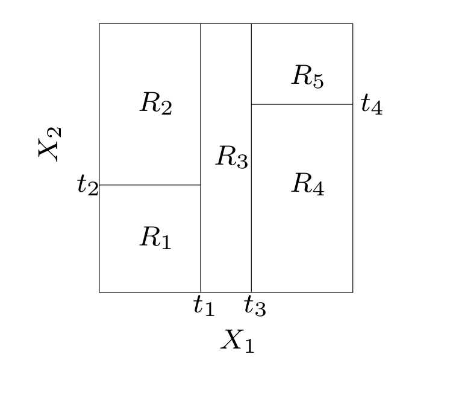
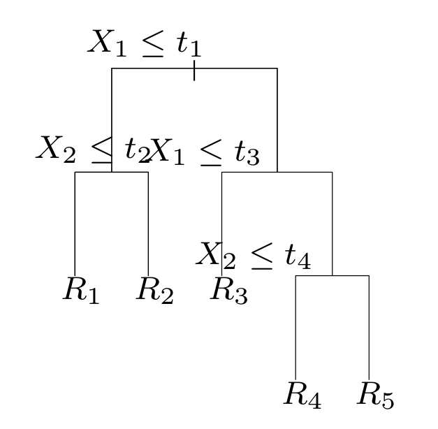
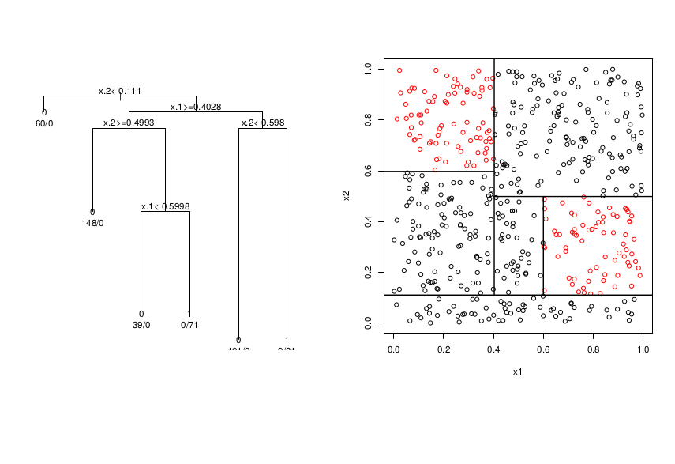

\newcommand{\X}{\mathbf{X}}
\newcommand{\Z}{\mathbf{Z}}
\newcommand{\y}{\mathbf{y}}
\newcommand{\be}{\mathbf{b}}
\newcommand{\b}{\boldsymbol\beta}
\newcommand{\ve}{\boldsymbol\varepsilon{}}
\newcommand{\hb}{\hat{\beta}}
\newcommand{\E}{\text{E}}
\newcommand{\P}{\text{Pr}}
\newcommand{\d}{\text{d}}
\newcommand{\var}{\text{var}}
\newcommand{\cov}{\text{cov}}
\newcommand{\cor}{\text{cor}}
\newcommand{\I}{\mathbf{I}}
\DeclareMathOperator*{\argmin}{arg\,min}
\DeclareMathOperator*{\argmax}{arg\,max}

# Introduction #

## Introduction ##

A particular kind of nonlinear predictive model: **prediction trees**.

2 varieties:

- *regression trees*
- *classification trees*

Then we'll look at ways to combine multiple trees

# Prediction trees #

## Prediction trees ##

Tree-based methods aim at predicting $y$ from a feature vector $x \in
\mathbb{R}^p$

1. Divide up the feature space into rectangles
2. Fit a very simple model in each rectangle

This works both when $y$ is discrete and continuous, i.e., both for
*classification* and *regression*

## Prediction trees ##

Consider a regression problem with a continuous response $Y$ and
explanatory variables $X_1$ and $X_2$.

1. Split the space into 2 regions
2. Model the response by the mean of $Y$ in each region. We choose the
   variable ($X_1$ or $X_2$) and split-point that achieve the best
   fit
3. One or both of these regions are split into two more regions
4. Continue until some stopping rule is applied

## Prediction trees ##



## Prediction trees ##

The result of this process is a partition into regions $R_1, R_2,
\dots, R_5$.

The corresponding regression model predicts $Y$ with a constant $c_m$
in Region $R_m$,

$\hat{f}(X) = \sum_{i = 1}^5 c_m\I\{(X_1, X_2) \in R_m\}$

This model can be represented by a binary tree

## Prediction trees ##



## Prediction trees ##



## Regression trees ##

The data consist of p explanatory variables and an outcome for $n$
individuals

- $(x_i, y_i)$ for $i = 1, \dots, n$
- $x_i = (x_{i1}, \dots, x_{ip})$

The algorithm needs to automatically decide on the splitting variables
and split points.

Suppose that we have a partition into $M$ regions $R_1, R_2, \dots,
R_M$, and we model the response as a constant $c_m$ in each region

$$f(x) = \sum_{m = 1}^M c_m\I(x \in R_m)$$

## Regression trees ##

Using the *sum  of squares*

$$\sum (y_i - f(x_i))^2$$

as minimisation criterion, the best $\hat{c}_m$ is the average of
$y_i$ in region $R_m$

$$\hat{c}_m = \frac{1}{n_m} \sum_{x_i \in R_m} y_i$$

But finding the best binary partition in terms of minimum sum of
squares is generally computationally infeasible. 

## Regression trees ##

Instead we use a *greedy algorithm*:

Starting with all the data, consider a splitting variable $j$ and
split point $s$, and define the pair of half-planes

$$
R_1(j, s) = \{X|X_j \leq s\} \quad \text{and} \quad R_2(j, s) =
\{X|X_j > s\}
$$

Then seek the splitting variable $j$ and split point $s$ that solve

$$ \min_{j, s}
\left[\min_{c_1} \sum_{x_i \in R_1(j, s)} (y_i - c_1)^2 +
\min_{c_2} \sum_{x_i \in R_2(j, s)} (y_i - c_2)^2\right]
$$

For any choice $j$ and $s$, the inner minimisation is solved by

$$
\hat{c}_1 = \frac{1}{n_1} \sum_{x_i \in R_1} y_i \quad \text{and}
\quad \hat{c}_2 = \frac{1}{n_2} \sum_{x_i \in R_2} y_i
$$

Having found the best split, we partition the data into the two
resulting regions and repeat the process in each of the two regions
...

## Regression trees ##

**How large should the tree be?**

Too large, we may overfit the data (e.g., 1 data point per region is
useless).

Too small, we might miss some important structure in the data

&rarr; Tree size is a tuning parameter governing the model's
complexity, and the optimal tree size should be chosen from the data

- One possibility would be to split the data only if a further split
  decreases the sum of squares more than a prespecified threshold
- Too short sighted: a seemingly worthless split might lead to a very
  good split below it 

## Regression trees ##

**Pruning**

1. Grow a large tree $T_0$, stopping the splitting process only when some
  minimum node size is reached

2. *Prune* this large tree using *cost-complexity pruning*

Define a subtree $T \subset T_0$ that can be obtained by pruning $T_0$

Let $m$ be the index of the terminal nodes, with node $m$ representing
region $R_m$.

Let $\lvert T \rvert$ denote the number of terminal nodes in $T$

## Regression trees ##

Let

$$
\begin{align}
N_m &= \#\{x_i \in R_m\}, \\
\hat{c}_m &= \frac{1}{n_m} \sum_{x_i \in R_m} y_i, \\
Q_m(T) &= \frac{1}{n_m} \sum_{x_i \in R_m} (y_i - \hat{c}_m)^2
\end{align}
$$

The cost complexity criterion is defined as

$$
C_\alpha(T) = \sum_{m = 1}^{\lvert T \rvert} N_mQ_m(T) + \alpha\lvert
T \rvert
$$

The tuning parameter $\alpha \geq 0$ governs the trade-off between
tree-size and goodness-of-fit.

$\alpha$ chosen via a validation set or **cross-validation**

## $k$-fold Cross-validation ##

Cross-validation is a widely used method for estimating prediction
error

- Randomly divide the set of observations into $k$ groups or *folds*
  of approximately equal size
- The first fold is treated as validation set while the tree is fitted
  on the remaining $k - 1$ folds
- Compute the prediction error in the held-out fold using (in our
  case)

$$L(Y^{-k}, \hat{f}^{-k}(X)) = (y^{-k} - \hat{f}^{-k}(x))^2$$

- The procedure is repeated $k$-times resulting in $k$ estimates of
  the test error

- The $k$-fold CV estimate is then

$$
CV_{(k)} = \frac{1}{k}\sum_{j = 1}^k L(Y^{-j}, \hat{f}^{-j}(X))
$$

$k$ is typically set to 5 or 10.

## Building a regression tree ##

1. Use recursive binary splitting to grow a large tree on the training
   data, stopping only when each terminal node has fewer than some
   minimum number of observations
2. Apply cost complexity pruning to the large tree in order to obtain
   a sequence of best subtrees as a function of $\alpha$
3. Use $k$-fold cross-validation to chose $\alpha$, i.e., divide the
   data into $K$ folds. For each $k = 1, \dots, K$

	1. Repeat 1. and 2. on all but the $k$-th fold
	2. Evaluate the MSE in the left-out fold as a function of
       $\alpha$.

   Average the results for each value of $\alpha$, and pick $\alpha$
   to minimise the average error

4. Return the subtree from Step 2 that corresponds to the chosen
   value of $\alpha$
    


## Classification trees ##

Now the target is a classification outcome taking values $1, 2, 3,
\dots, K$

The only changes needed in the algorithm is in the splitting
criterion and how to prune the tree

Let

$$
\hat{p}_{mk} = \frac{1}{n_m} \sum_{x_i \in R_m} \I(y_i = k)
$$

the proportion of class $k$ observations in node $m$.

We classify the observations in node $m$ to class

$$k(m) = \argmax_k \hat{p}_{mk}$$

## Classification trees ##

Different measures of node impurity can be defined

- *Missclassification error:* $\frac{1}{n_m}\sum_{i \in R_m} \I(y_i
  \neq k(m)) = 1 - \hat{p}_{mk}$
- *Gini index:* $\sum_{k \neq k'} \hat{p}_{mk}\hat{p}_{mk'} = \sum_{k =
  1}^K \hat{p}_{mk}(1 - \hat{p}_{mk})$
- *Cross-entropy or deviance:* $-\sum_{k=1}^K \hat{p}_{mk}\log\hat{p}_{mk}$

The latter 2 have the advantage that they are differentiable, hence
more amenable to numerical optimisation

## Illustration ##

**Forbes2000**


The `Forbes2000` contains the list of the world's biggest industrial
companies. Here, our interest is to construct a model explaining the
profit of a company based on assets, sales and the market value.


```r
data("Forbes2000", package = "HSAUR3")
head(Forbes2000)
```

```
  rank                name        country             category  sales
1    1           Citigroup  United States              Banking  94.71
2    2    General Electric  United States        Conglomerates 134.19
3    3 American Intl Group  United States            Insurance  76.66
4    4          ExxonMobil  United States Oil & gas operations 222.88
5    5                  BP United Kingdom Oil & gas operations 232.57
6    6     Bank of America  United States              Banking  49.01
  profits  assets marketvalue
1   17.85 1264.03      255.30
2   15.59  626.93      328.54
3    6.46  647.66      194.87
4   20.96  166.99      277.02
5   10.27  177.57      173.54
6   10.81  736.45      117.55
```

## Illustration &mdash; Forbes ##


```r
library("rpart", quietly = TRUE)
Forbes2000 <- subset(Forbes2000, !is.na(profits))
fm <- profits ~ assets + marketvalue + sales
forbes_rpart <- rpart(fm, data = Forbes2000)
```

## Illustration &mdash; Forbes ##

- Plot tree


```r
library(partykit, quietly = TRUE)
plot(as.party(forbes_rpart))
```


## Illustration &mdash; Forbes ##

- Complexity parameter


```r
print(forbes_rpart$cptable)
```

```
          CP nsplit rel error    xerror      xstd
1 0.23748446      0 1.0000000 1.0012286 0.1947829
2 0.04600397      1 0.7625155 0.8042608 0.1893762
3 0.04258786      2 0.7165116 0.8162056 0.2060592
4 0.02030891      3 0.6739237 0.7343190 0.1970225
5 0.01854336      4 0.6536148 0.7727965 0.1977633
6 0.01102304      5 0.6350714 0.8248992 0.2109600
7 0.01076006      6 0.6240484 0.8194330 0.2112987
8 0.01000000      7 0.6132883 0.8210051 0.2136873
```

```r
plotcp(forbes_rpart)
```


## Illustration &mdash; Forbes ##


```r
opt <- which.min(forbes_rpart$cptable[,"xerror"])
cp <- forbes_rpart$cptable[opt, "CP"]
forbes_prune <- prune(forbes_rpart, cp = cp)
plot(as.party(forbes_prune))
```


## Illustration &mdash; Glaucoma ##

For $196$ people, $98$ patients suffering glaucoma and $98$ controls
which have been matched by age and sex, $62$ numeric variables derived
from the laser scanning images are available.

The variables describe the morphology of the optic nerve head, i.e.,
measures of volumes and areas in certain regions of the eye
background. Those regions have been manually outlined by a
physician. Our aim is to construct a prediction model which is able to
decide whether an eye is affected by glaucomateous changes based on
the laser image data.

Here, we are primarily interested in the construction of a
predictor. The relationship between the $62$ covariates and the
glaucoma status itself is not very interesting.  We start with a large
initial tree and prune back branches according to the cross-validation
criterion.

## Illustration &mdash; Glaucoma ##


```r
data("GlaucomaM", package = "TH.data")
set.seed(290875)
glaucoma_rpart <- rpart(Class ~ ., data = GlaucomaM,
              control = rpart.control(minsplit = 2, xval = 100))
glaucoma_rpart$cptable
```

```
          CP nsplit  rel error    xerror       xstd
1 0.65306122      0 1.00000000 1.5306122 0.06054391
2 0.07142857      1 0.34693878 0.3877551 0.05647630
3 0.04081633      2 0.27551020 0.3571429 0.05471329
4 0.03061224      3 0.23469388 0.4081633 0.05757556
5 0.02551020      4 0.20408163 0.4489796 0.05960655
6 0.02040816      6 0.15306122 0.4591837 0.06008148
7 0.01020408      9 0.09183673 0.4897959 0.06143238
8 0.01000000     16 0.02040816 0.5510204 0.06382443
```

```r
opt <- which.min(glaucoma_rpart$cptable[,"xerror"])
cp <- glaucoma_rpart$cptable[opt, "CP"]
glaucoma_prune <- prune(glaucoma_rpart, cp = cp)
```

## Illustration &mdash; Glaucoma ##


```r
plot(as.party(glaucoma_prune))
```


## Illustration &mdash; Glaucoma ##

**Instability of trees**


```r
nsplitopt <- vector(mode = "integer", length = 25)
for (i in 1:length(nsplitopt)) {
    cp <- rpart(Class ~ ., data = GlaucomaM)$cptable
    nsplitopt[i] <- cp[which.min(cp[,"xerror"]), 
        "nsplit"]
}
table(nsplitopt)
```

```
nsplitopt
 1  2  5 
14  7  4 
```


## Summary ##

Trees are easy to interpret

but have a high variance

# Bagging #

## Bootstrap ##

The *bootstrap* is a widely applicable and extremely powerful
statistical tool that can be used to quantify the uncertainty
associated with a given estimator or statistical learning method.

Suppose that a r.v $Y$ comes from a c.d.f $F(y) = \P(Y \leq y)$
and that we have a sample of size $n$ coming from this unknown
distribution.

As $F$ is unknown we can't do any derivation analytically &rarr;
Simulate! But we don't know $F$

$F$ can be estimated from the empirical c.d.f

$$F_n(y) = \frac{1}{n}\sum_{i = 1}^n \I(Y_i \leq y).$$

Now pretend that $F_n(y)$ is the original population distribution
$F(y)$.

Sampling from $F_n$ is equivalent to sampling with replacement from
the observed data $Y_1, Y_2, \dots, Y_n$

## Bootstrap ##

- Take $B$ samples of size $n$ with replacement
	- With $B$ chosen such that the summary measure of the individual
      statistics is nearly as good as taking $B = \infty$

- Compute your statistic $T_b$ on each *bootstrapped sample*\

- Summarise, e.g.,

$$
\widehat{\var}(T) = \frac{1}{B - 1} \sum_{b = 1}^B (T_b - \bar{T})^2
$$

with $\bar{T} = 1/B \sum_b T_b$

## Bagging ##

Consider we fit a model to the training data $\Z = \{(x_1, y_1),
\dots, (x_n, y_n)\}$ and obtain the prediction $\hat{f}(x)$ for input
$x$.

Bootstrap aggregation or *bagging* averages this prediction over a
collection of bootstrap samples

&rarr; Reduction in variance

## Bagging ##

For each bootstrap sample $\Z^{*b},\, b = 1, 2, \dots, B$, fit the model
and obtain prediction $\hat{f}^{*b}$.

The bagging estimate is defined as

$$
\hat{f}_{\text{bag}}(x) = \frac{1}{B} \sum_{b = 1}^B \hat{f}^{*b}
$$

# Random Forest #

## Motivation ##

The idea of bagging was to average many noisy but unbiased models, and
thus reduce the variance

Each tree generated in bagging is i.d.

- The bias of bagged trees is the same as that of the individual trees
- The variance of the average (with positive pairwise correlation
  $\rho$) is

$$\rho\sigma^2 + \frac{1 - \rho}{B}\sigma^2$$

As $B$ increases, the second term disappears but the correlation of
bagged trees limits the benefits of averaging.

&rarr; The idea of *random forest* is to "de-correlate" the trees
through random selection of the input variables

## Random Forest Algorithm ##

1. For $b = 1$ to $B$:

	1. Draw a bootstrap sample $\Z^*$ of size $n$ from the data
	2. Grow a random-forest tree $T_b$ to the bootstrapped data until
       the minimum node size $n_{\min}$ is reached by repeating the
       following steps

	     1. Select $m$ variables at random from the $p$ variables
         2. Pick the best variable/split-point among the $m$
	     3. Split the node into two daughter nodes

2. Output the ensemble of trees $\{T_b\}^B_1$
	
To make a prediction at a new point $x$:

- *regression:* $\hat{f}_{\text{rf}}^B(x) = \frac{1}{B}\sum_{b=1}^B T_b(x)$

- *classification:* Let $\hat{C}_b(x)$ be the class prediction of the
  $b$-th random-forest tree. Then $\hat{C}_{\text{rf}}^B(x) =$
  *majority vote* $\{\hat{C}_{\text{rf}}^B(x)\}_1^B$

## Choice of $m$ ##

The inventors of random forest make the following recommendations

- For classification, the default value for $m$ is $\lfloor \sqrt{p}
  \rfloor$ and the minimum node size is one
- For regression, the default value for $m$ is $\lfloor p/3 \rfloor$
  and the minimum node size is five

In practice, $m$ should be treated as a tuning parameter

## Out-of-bag Samples ##

An important feature of random forests is its use of *out-of-bag*
(OOB) samples:

- On average, each bootstrapped tree makes use of around two-third of
  the observations. The remaining 1/3 of the observations not used to
  fit a given tree are called *out-of-bag* observations
- For each observation $z_i = (x_i, y_i)$, construct its random forest
  predictor by averaging **only** those trees corresponding to
  bootstrap samples in which $z_i$ **did not** appear

An OOB error estimate is almost the same as that obtained by $K$-fold
cross-validation.

No need for separate test data

## Interpretation ##

Simple trees are easy to interpret. The entire model can be
represented by a single graphic

Random forest and bagging loose this important feature and must be
interpreted in different ways

## Variable importance ##

For a single decision tree, the following measure can be used to
compute a relative importance of a predictor $X_l$

$${\cal I}_l^2(T) = \sum_{j = 1}^{J-1} \hat{i}_t^2\I(v(t) = l),$$

- the sum is over the $J - 1$ internal nodes of the tree
- At each node $t$, one of the input variable $X_{v(t)}$ is used to
  partition the region
- The particular variable chosen is the one that gives maximal
  estimated improvement $\hat{i}_t^2$ in squared error risk (or Gini
  index, ...)

The squared relative importance of variable $X_l$ is the sum of such
squared improvements over all internal nodes for which it was chosen
as the splitting variable

For bagging and random forests, this measure is averaged over the
trees

$${\cal I}_l^2 = \frac{1}{B}\sum_{b=1}^B {\cal I}_l^2(T_b)$$

## Illustration &mdash; Glaucoma ##

- Bagging. It's a random forest without random selection of the
  predictors


```r
(glau_bag <- randomForest(Class ~ ., GlaucomaM, mtry = ncol(GlaucomaM) - 1, importance = TRUE))
```

```

Call:
 randomForest(formula = Class ~ ., data = GlaucomaM, mtry = ncol(GlaucomaM) -      1, importance = TRUE) 
               Type of random forest: classification
                     Number of trees: 500
No. of variables tried at each split: 62

        OOB estimate of  error rate: 15.82%
Confusion matrix:
         glaucoma normal class.error
glaucoma       78     20   0.2040816
normal         11     87   0.1122449
```

## Illustration &mdash; Glaucoma ##

- Random forest


```r
(glau_rf <- randomForest(Class ~ ., GlaucomaM, mtry = floor(sqrt(ncol(GlaucomaM) - 1)), importance = TRUE))
```

```

Call:
 randomForest(formula = Class ~ ., data = GlaucomaM, mtry = floor(sqrt(ncol(GlaucomaM) -      1)), importance = TRUE) 
               Type of random forest: classification
                     Number of trees: 500
No. of variables tried at each split: 7

        OOB estimate of  error rate: 13.78%
Confusion matrix:
         glaucoma normal class.error
glaucoma       82     16   0.1632653
normal         11     87   0.1122449
```

## Illustration &mdash; Glaucoma ##

Find $mtry$ through cross-validation


```r
set.seed(434)
mtry_find_glau <- rfcv(GlaucomaM[, -ncol(GlaucomaM)], GlaucomaM[, ncol(GlaucomaM)],
                       mtry = function(p) max(p/2, 1), step = 0.7)

plot(mtry_find_glau$n.var, mtry_find_glau$error.cv, type = "p", cex = 2)
lines(mtry_find_glau$n.var, mtry_find_glau$error.cv)
```


## Illustration &mdash; Glaucoma ##


```r
rf_glau_ <- randomForest(Class ~ ., GlaucomaM,
                         mtry = mtry_find_glau$n.var[which.min(mtry_find_glau$error.cv)],
                         importance = TRUE)

varImpPlot(rf_glau_, type = 2)
```


